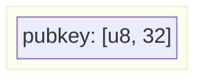
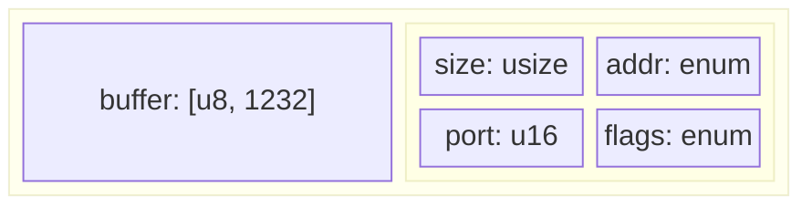
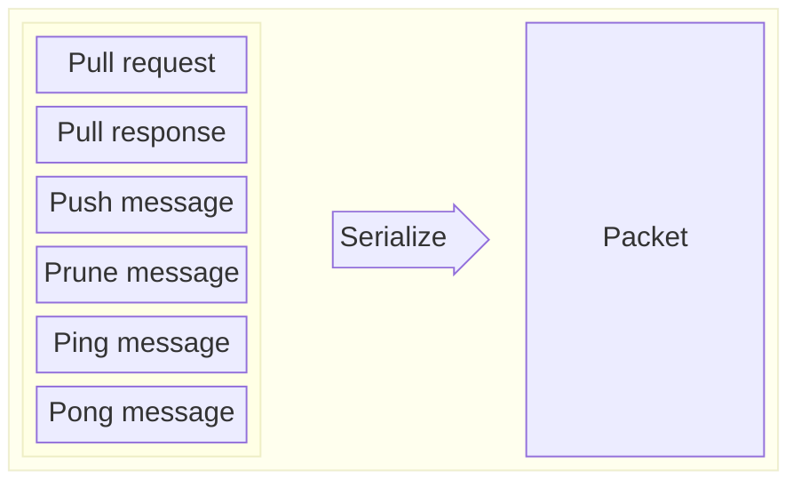
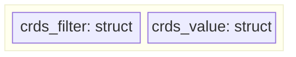
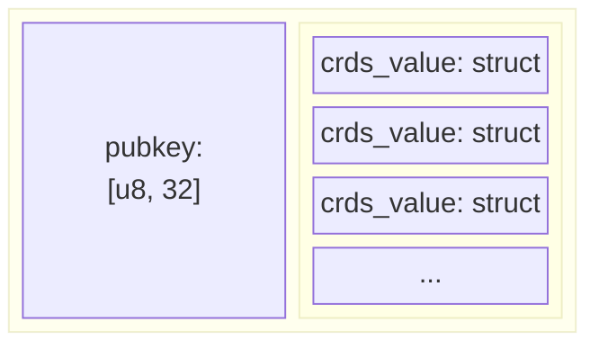
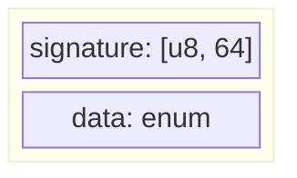
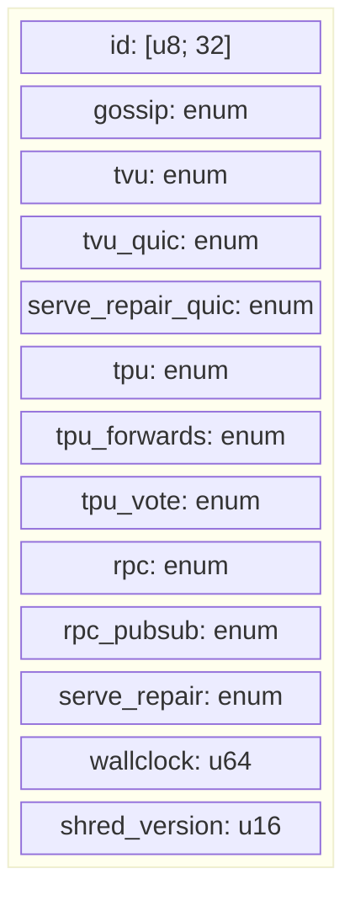
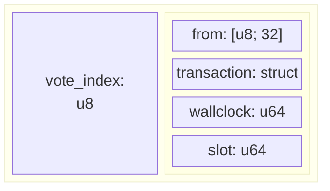
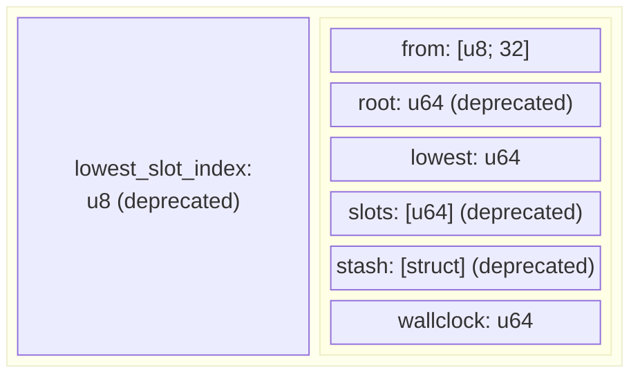

# Gossip protocol

This document describes the gossip protocol without implementation details which can be found [here](/implementation-details.md).

Solana nodes communicate with each other and share data using the gossip protocol. They send messages in a binary form which nodes need to deserialize. There are 6 types of messages:
* pull request
* pull response
* push message
* prune message
* ping
* pong

Each message contains data specific to its type: values that nodes share between them, filters, pruned nodes, etc. Nodes keep their data in [_Cluster Replicated Data Store_ (`crds`)](/implementation-details.md#cluster-replicated-data-store) which is synchronized between them via pull requests, push messages and pull responses.

### Type definitions
In the diagrams below fields are presented with their data types, e,g:

which means `Pubkey` is an 32-elements array of bytes (8-bit unsigned integer). This spec is using `Rust` notation:
* `u8` - 1 byte of unsigned data (8-bit unsigned integer)
* `u16` - 16-bit unsigned integer
* `u32` - 32-bit unsigned integer, and so on...
* `usize` - on 32-bit architecture it's a 32-bit unsigned integer, on 64-bit one an 64-bit unsigned integer
* `[u8, 32]` - array of 32 elements, with each element being 1 byte
* `enum` - an enumeration type
* `struct` - a complex type, consisting of many elements of different types 


## Message format
Packet:



Each message is sent in a binary form with a maximum size of 1232 bytes (1280 is a minimum `IPv6 TPU`, 40 bytes is the size of `IPv6` header and 8 bytes is the size of the fragment header). Apart from the actual data, packet contains additional metadata:

 * `size` - size of the packet
 * `addr` - address of the origin
 * `port` - port of the origin
 * `flags` - additional flags

<details>
  <summary>Solana client Rust implementation</summary>

```rust
struct Packet {
    buffer: [u8; 1232],
    meta: Meta,
}

struct Meta {
    size: usize,
    addr: IpAddr,
    port: u16,
    flags: PacketFlags,
}

enum PacketFlags {
    const DISCARD        = 0b0000_0001;
    const FORWARDED      = 0b0000_0010;
    const REPAIR         = 0b0000_0100;
    const SIMPLE_VOTE_TX = 0b0000_1000;
    const TRACER_PACKET  = 0b0001_0000;
    const ROUND_COMPUTE_UNIT_PRICE = 0b0010_0000;
}

enum IpAddr {
    V4(Ipv4Addr),
    V6(Ipv4Addr)
}
```

</details>


Data sent in the message is serialized from a `Protocol` type, which can be one of:
* [pull request](#pullrequest)
* [pull response](#pullresponse)
* [push message](#pushmessage)
* [prune message](#prunemessage)
* [ping message](#pingmessage)
* [pong message](#pongmessage)



<details>
  <summary>Solana client Rust implementation</summary>

``` rust
enum Protocol
{
    PullRequest(CrdsFilter, CrdsValue),
    PullResponse(Pubkey, [CrdsValue]),
    PushMessage(Pubkey, [CrdsValue]),
    PruneMessage(Pubkey, PruneData),
    PingMessage(Ping),
    PongMessage(Pong)
}
```

</details>

### PullRequest

Is sent by node to ask the cluster for new information. It contains a bloom filter with things node already has. Nodes receiving pull requests gather all new values from their `crds`, filter them using provided filters and send `PullResponse` to the origin of the request.

`PullRequest` message contains two values:
  * `CrdsFilter` - a bloom filter representing things node already has
  * `CrdsValue` - a [value](#data-shared-between-nodes), usually a `LegacyContactInfo` of the node who send the pull request containing nodes socket addresses for different protocols (gossip, tvu, tpu, rpc, etc.)

### PullResponse

These are sent in response to `PullRequest` and contain:
  * `pubkey` - a public key of the origin
  * `[crds_value]` - a list of new values 

### PushMessage

It is sent by nodes who want to share information with others. Node receiving the message checks for:
- duplication - duplicated messages are dropped, node responses with prune message if message came from low staked node
- new data:
    - new information is stored in `crds` and replaces old value
    - stores message in `pushed_once` which is used for detecting duplicates
    - retransmits information to its peers
- expiration - messages older than `PUSH_MSG_TIMEOUT` are dropped

The `PushMessage` contains:
  *  `pubkey` - a public key of the origin
  * `[crds_value]` - list of values to share

## Data shared between nodes

The `CrdsValue` values that are sent in push messages, pull requests & pull responses contain signature and the actual shared data:

<details>
  <summary>Solana client Rust implementation</summary>

```rust
struct CrdsValue {
    signature: Signature,
    data: CrdsData,
}
```
</details>

### CrdsData
The `CrdsValue` data (`CrdsData`) can be one of:
* [LegacyContactInfo](#legacycontactinfo)
* [Vote](#vote)
* [LowestSlot](#lowestslot)
* LegacySnapshotHashes
* AccountsHashes
* EpochSlots
* LegacyVersion
* Version
* NodeInstance
* DuplicateShred
* SnapshotHashes
* ContactInfo
* RestartLastVotedForkSlots
* RestartHeaviestFork

<details>
  <summary>Solana client Rust implementation</summary>

```rust
enum CrdsData
{
    LegacyContactInfo(LegacyContactInfo),
    Vote(VoteIndex, Vote),
    LowestSlot(u8, LowestSlot),
    LegacySnapshotHashes(LegacySnapshotHashes),
    AccountsHashes(AccountsHashes),
    EpochSlots(EpochSlotsIndex, EpochSlots),
    LegacyVersion(LegacyVersion),
    Version(Version),
    NodeInstance(NodeInstance),
    DuplicateShred(DuplicateShredIndex, DuplicateShred),
    SnapshotHashes(SnapshotHashes),
    ContactInfo(ContactInfo),
    RestartLastVotedForkSlots(RestartLastVotedForkSlots),
    RestartHeaviestFork(RestartHeaviestFork),
}
```
</details>

#### LegacyContactInfo


Basic info about the node. Nodes send this message to introduce themselves and provide all addresses and ports that can be used by their peers to communicate with them:
- `id` - public key of origin
- `gossip` - gossip protocol address
- `tvu` - address to connect to for replication
- `tvu_quic` - TVU over QUIC protocol
- `serve_repair_quic` - repair service for QUIC protocol
- `tpu` - transactions address
- `tpu_forwards` - address to forward unprocessed transactions
- `tpu_vote` - address for sending votes
- `rpc` - address for JSON-RPC requests
- `rpc_pubsub` - websocket for JSON-RPC push notifications
- `serve_repair` - address for sending repair requests
- `wallclock` - wallclock of the node that generated that message
- `shred_version` - the shred version node has been configured to use

<details>
  <summary>Solana client Rust implementation</summary>

```rust
struct LegacyContactInfo {
    id: Pubkey,
    gossip: SocketAddr,
    tvu: SocketAddr,
    tvu_quic: SocketAddr,
    serve_repair_quic: SocketAddr,
    tpu: SocketAddr,
    tpu_forwards: SocketAddr,
    tpu_vote: SocketAddr,
    rpc: SocketAddr,
    rpc_pubsub: SocketAddr,
    serve_repair: SocketAddr,
    wallclock: u64,
    shred_version: u16,
}

enum SocketAddr {
    V4(SocketAddrV4 {
        ip: Ipv4Addr,
        port: u16
    }),
    V6(SocketAddrV6 {
        ip: Ipv6Addr,
        port: u16,
        flowinfo: u32,
        scope_id: u32
    })
}

struct Ipv4Addr {
    octets: [u8, 4]
}

struct Ipv6Addr {
    octets: [u8, 32]
}
```

</details>

#### Vote

It's a validators vote on a fork. Contains a one byte index from vote tower (range 0 to 31) and a `Vote` structure:
 - `from` - public key of origin
 - [`transaction`](#transaction) - a vote transaction, an atomically-committed sequence of instructions
 - `wallclock` - wallclock of the node that generated that message
 - `slot` - slot in which the vote was created

<details>
  <summary>Solana client Rust implementation</summary>

 ```rust
 struct Vote {
    from: Pubkey,
    transaction: Transaction,
    wallclock: u64,
    slot: Slot | None,
}

type Slot = u64
```
</details>

##### Transaction
A vote transaction, contains a signature and a message with sequence of instructions:
 * `signature` - list of signatures equal to `num_required_signatures` for the message
 * `message` - transaction message containing instructions to invoke:
    * `header` - message header:
        * `num_required_signatures` - number of signatures required for this message to be considered valid
        * `num_readonly_signed_accounts` - last `num_readonly_signed_accounts` of the signed keys are read-only accounts
        * `num_readonly_unsigned_accounts` - last `num_readonly_unsigned_accounts` of the unsigned keys are read-only accounts
    * `account_keys` - all account keys used by this transaction
    * `recent_blockhash` - hash of a recent ledger entry
    * `instructions` - list of programs to execute:
        * `program_id_index` - index of the transaction keys array indicating the program account ID that executes the program,
        * `accounts` - indices of the transaction keys array indicating the accounts that are passed to a program
        * `data` - program input data

<details>
  <summary>Solana client Rust implementation</summary>

```rust
struct Transaction {
    signature: [Signature],
    message: Message
}

struct Message {
    header: MessageHeader,
    account_keys: [Pubkey],
    recent_blockhash: Hash,
    instructions: [CompiledInstruction],
}

struct MessageHeader {
    num_required_signatures: u8,
    num_readonly_signed_accounts: u8,
    num_readonly_unsigned_accounts: u8,
}

struct CompiledInstruction {
    program_id_index: u8,
    accounts: [u8],
    data: [u8],
}
```
</details>

#### LowestSlot

It is the first available slot in Solana [blockstore](https://docs.solanalabs.com/validator/blockstore) that contains any data. Contains a one byte index (deprecated) and a `LowestSlot` structure:
##### `LowestSlot`
- `from` - public key of origin
- `root` - _deprecated_
- `lowest` - the actual slot
- `slots` - _deprecated_
- `stash` - _deprecated_
- `wallclock` - wallclock of the node that generated that message

<details>
  <summary>Solana client Rust implementation</summary>

```rust
struct LowestSlot {
    from: Pubkey,
    root: Slot,
    lowest: Slot,
    slots: [Slot],
    stash: [EpochIncompleteSlots],
    wallclock: u64,
}
struct EpochIncompleteSlots {
    first: Slot,
    compression: CompressionType,
    compressed_list: [u8],
}
enum CompressionType {
    Uncompressed,
    GZip,
    BZip2,
}
```
</details>
