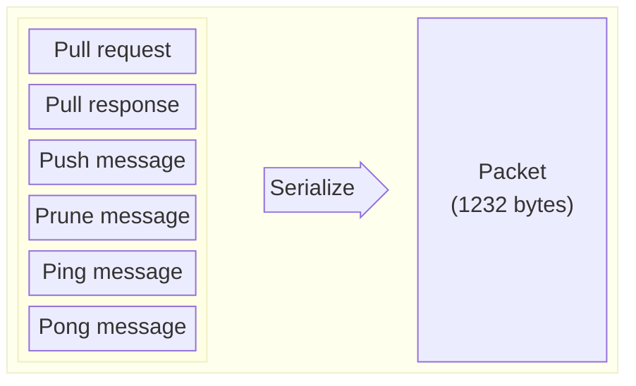

# Gossip protocol

This document describes the gossip protocol without implementation details which can be found [here](/implementation-details.md).

Solana nodes communicate with each other and share data using the gossip protocol. They send messages in a binary form which need to be deserialized. There are 6 types of messages:
* pull request
* pull response
* push message
* prune message
* ping
* pong

Each message contains data specific to its type: values that nodes share between them, filters, pruned nodes, etc. Nodes keep their data in _Cluster Replicated Data Store_ (`crds`) which is synchronized between them via pull requests, push messages and pull responses.

### Type definitions
Fields described in the tables below have their types specified using Rust notation:
* `u8` - 1 byte of unsigned data (8-bit unsigned integer)
* `u16` - 16-bit unsigned integer
* `u32` - 32-bit unsigned integer, and so on...
* `[u8]` - dynamic size array of 1 byte elements
* `[u8, 32]` - static size array of 32 elements, with each element being 1 byte
* `[[u8, 64]]` - a two dimensional array containing an arrays of 64 1 byte elements 
* `enum` - an enumeration type - it is a Rust `enum` which in other languages (C for example) can be implemented as an `union`
* `struct` - a complex type, consisting of many elements of different types

The **Size** column in tables contains the size of data in bytes. Size of dynamic arrays contains additional _plus_ (`+`) sign, e.g. `32+` which means the array has at least 32 bytes. Empty dynamic arrays always have 8 bytes which is the size of array header containing array length. 
In case size of a particular complex data is unknown it is marked with `?`. The limit however is always 1232 bytes for the whole data packet.

## Message format

Each message is sent in a binary form with a maximum size of 1232 bytes (1280 is a minimum `IPv6 TPU`, 40 bytes is the size of `IPv6` header and 8 bytes is the size of the fragment header). 


Data sent in the message is serialized from a `Protocol` type, which can be one of:

| Message                        | Data                      | Description |
|--------------------------------|---------------------------|------------|
| [pull request](#pullrequest)   | `CrdsFilter`, `CrdsValue` | sent by node to ask for new information |
| [pull response](#pullresponse) | `Pubkey`, `[CrdsValue]`   | response to a pull request |
| [push message](#pushmessage)   | `Pubkey`, `CrdsValue`     | sent by node to share its data |
| [prune message](#prunemessage) | `Pubkey`, `PruneData`     | sent to peers with a list of nodes which should be pruned |
| [ping message](#pingmessage)   | `Ping`                    | a ping message |
| [pong message](#pongmessage)   | `Pong`                    | response to a ping |



<details>
  <summary>Solana client Rust implementation</summary>

``` rust
enum Protocol
{
    PullRequest(CrdsFilter, CrdsValue),
    PullResponse(Pubkey, [CrdsValue]),
    PushMessage(Pubkey, [CrdsValue]),
    PruneMessage(Pubkey, PruneData),
    PingMessage(Ping),
    PongMessage(Pong)
}
```

</details>

### PullRequest

| Data | Type | Size | Description |
|------|:----:|:----:|-------------|
| `CrdsFilter` | `struct` | 37+ | a bloom filter representing things node already has |
| `CrdsValue` | `struct` | ? | a [value](#data-shared-between-nodes), usually a `LegacyContactInfo` of the node who send the pull request containing nodes socket addresses for different protocols (gossip, tvu, tpu, rpc, etc.) |

It is sent by node to ask the cluster for new information. It contains a bloom filter with things node already has. Nodes receiving pull requests gather all new values from their `crds`, filter them using provided filters and send `PullResponse` to the origin of the request.

<details>
  <summary>Solana client Rust implementation</summary>

``` rust
struct CrdsFilter {
    filter: Bloom,
    mask: u64,
    mask_bits: u32,
}

struct Bloom {
    keys: Vec<u64>,
    bits: BitVec<u64>,
    num_bits_set: u64,
}
```

</details>

### PullResponse

| Data | Type | Size | Description |
|------|:----:|:----:|-------------|
| `Pubkey` | `[u8, 32]` | 32 | a public key of the origin |
| `[CrdsValue]` | `[struct]` | 8+ | a list of new values  |

These are sent in response to a `PullRequest`.


### PushMessage

| Data | Type | Size | Description |
|------|:----:|:----:|-------------|
| `Pubkey` | `[u8, 32]` | 32 | a public key of the origin |
| `[CrdsValue]` | `[struct]` | 8+ | a list of values to share  |

It is sent by nodes who want to share information with others. Node receiving the message checks for:
- duplication - duplicated messages are dropped, node responses with prune message if message came from low staked node
- new data:
    - new information is stored in `crds` and replaces old value
    - stores message in `pushed_once` which is used for detecting duplicates
    - retransmits information to its peers
- expiration - messages older than `PUSH_MSG_TIMEOUT` are dropped

## Data shared between nodes

The `CrdsValue` values that are sent in push messages, pull requests & pull responses contain signature and the actual shared data:

| Data | Type | Size | Description |
|------|:----:|:----:|-------------|
| `signature` | `[u8, 64]` | 64 | signature of origin |
| `data` | `enum` | ? | data  |

<details>
  <summary>Solana client Rust implementation</summary>

```rust
struct CrdsValue {
    signature: Signature,
    data: CrdsData,
}

enum CrdsData {
    LegacyContactInfo(LegacyContactInfo),
    Vote(VoteIndex, Vote),
    LowestSlot(LowestSlotIndex, LowestSlot),
    EpochSlots(EpochSlotsIndex, EpochSlots),
    LegacyVersion(LegacyVersion),
    Version(Version),
    NodeInstance(NodeInstance),
    DuplicateShred(DuplicateShredIndex, DuplicateShred),
    SnapshotHashes(SnapshotHashes),
    ContactInfo(ContactInfo),
    RestartLastVotedForkSlots(RestartLastVotedForkSlots),
    RestartHeaviestFork(RestartHeaviestFork),
}
```
</details>

### CrdsData
The `CrdsValue` data (`CrdsData`) can be one of:
* [LegacyContactInfo](#legacycontactinfo)
* [Vote](#vote)
* [LowestSlot](#lowestslot)
* LegacySnapshotHashes
* AccountsHashes
* EpochSlots
* LegacyVersion
* Version
* NodeInstance
* DuplicateShred
* SnapshotHashes
* ContactInfo
* RestartLastVotedForkSlots
* RestartHeaviestFork

<details>
  <summary>Solana client Rust implementation</summary>

```rust
enum CrdsData
{
    LegacyContactInfo(LegacyContactInfo),
    Vote(VoteIndex, Vote),
    LowestSlot(LowestSlotIndex, LowestSlot),
    LegacySnapshotHashes(LegacySnapshotHashes),
    AccountsHashes(AccountsHashes),
    EpochSlots(EpochSlotsIndex, EpochSlots),
    LegacyVersion(LegacyVersion),
    Version(Version),
    NodeInstance(NodeInstance),
    DuplicateShred(DuplicateShredIndex, DuplicateShred),
    SnapshotHashes(SnapshotHashes),
    ContactInfo(ContactInfo),
    RestartLastVotedForkSlots(RestartLastVotedForkSlots),
    RestartHeaviestFork(RestartHeaviestFork),
}
```
</details>

#### LegacyContactInfo

| Data | Type | Size | Description |
|------|:----:|:----:|-------------|
| `id` | `[u8, 32]` | 32 | public key of the origin |
| `gossip` | `struct` | 10 or 22 * |  gossip protocol address |
| `tvu` | `struct` | 10 or 22 | address to connect to for replication |
| `tvu_quic` | `struct` | 10 or 22 | TVU over QUIC protocol |
| `serve_repair_quic` | `struct` | 10 or 22 | repair service for QUIC protocol |
| `tpu` | `struct` | 10 or 22 | transactions address |
| `tpu_forwards` | `struct` | 10 or 22 | address to forward unprocessed transactions |
| `tpu_vote` | `struct` | 10 or 22 | address for sending votes |
| `rpc` | `struct` | 10 or 22 | address for JSON-RPC requests |
| `rpc_pubsub` | `struct` | 10 or 22 | websocket for JSON-RPC push notifications |
| `serve_repair` | `struct` | 10 or 22 | address for sending repair requests |
| `wallclock` | `u64` | 8 | wallclock of the node that generated that message |
| `shred_version` | `u16` | 2 | the shred version node has been configured to use |

\* _size of the address field is 10 bytes for IPv4 address and 22 bytes for IPv6 address_

Basic info about the node. Nodes send this message to introduce themselves and provide all addresses and ports that can be used by their peers to communicate with them. 

<details>
  <summary>Solana client Rust implementation</summary>

```rust
struct LegacyContactInfo {
    id: Pubkey,
    gossip: SocketAddr,
    tvu: SocketAddr,
    tvu_quic: SocketAddr,
    serve_repair_quic: SocketAddr,
    tpu: SocketAddr,
    tpu_forwards: SocketAddr,
    tpu_vote: SocketAddr,
    rpc: SocketAddr,
    rpc_pubsub: SocketAddr,
    serve_repair: SocketAddr,
    wallclock: u64,
    shred_version: u16,
}

enum SocketAddr {
    V4(SocketAddrV4),
    V6(SocketAddrV6)
}

struct SocketAddrV4 {
    ip: Ipv4Addr,
    port: u16,
}

struct SocketAddrV6 {
    ip: Ipv6Addr,
    port: u16,
    flowinfo: u32,
    scope_id: u32
}

struct Ipv4Addr {
    octets: [u8; 4]
}

struct Ipv6Addr {
    octets: [u8; 16]
}
```

</details>

#### Vote

| Data | Type | Size | Description |
|------|:----:|:----:|-------------|
| `index` | `u8` | 1 | vote tower index | 
| `from` | `[u8, 32]` | 32 | public key of the origin |
| [`transaction`](#transaction)  | `struct` | 59+ | a vote transaction, an atomically-committed sequence of instructions |
| `wallclock`  | `u64` | 8 |  wallclock of the node that generated that message |
| `slot`  | `u64` | 8 |  slot in which the vote was created |

It's a validators vote on a fork. Contains a one byte index from vote tower (range 0 to 31) and vote transaction to execute by the leader.

##### Transaction
| Data | Type | Size | Description |
|------|:----:|:----:|-------------|
| `signature` | `[[u8, 64]]` | 8+ | list of signatures equal to `num_required_signatures` for the message |
| `message` | `struct` | 51+ | transaction message containing instructions to invoke |


A vote transaction, contains a signature and a message with sequence of instructions:
 * `signature` - list of signatures equal to `num_required_signatures` for the message
 * `message` - transaction message containing instructions to invoke:

 ##### Message

| Data | Type | Size | Description |
|------|:----:|:----:|-------------|
| [`header`](#message-header) | `struct` | 3 | message header |
| `account_keys` | `[[u8, 32]]` | 32+ | all account keys used by this transaction |
| `recent_blockhash` | `[u8, 32]` | 32 |hash of a recent ledger entry |
| [`instructions`](#compiled-instruction) | `[struct]` | 17+ | list of compiled instructions to execute |

##### Message header

| Data | Type | Size | Description |
|------|:----:|:----:|-------------|
| `num_required_signatures` | `u8` | 1 | number of signatures required for this message to be considered valid |
| `num_readonly_signed_accounts` | `u8` | 1 | last `num_readonly_signed_accounts` of the signed keys are read-only accounts |
| `num_readonly_unsigned_accounts` | `u8` | 1 | last `num_readonly_unsigned_accounts` of the unsigned keys are read-only accounts |

##### Compiled instruction

| Data | Type | Size | Description |
|------|:----:|:----:|-------------|
| `program_id_index` | `u8` | 1 | index of the transaction keys array indicating the program account ID that executes the program |
| `accounts` |`[u8]` | 8+ | indices of the transaction keys array indicating the accounts that are passed to a program |
| `data` | `[u8]` | 8+ | program input data |

<details>
  <summary>Solana client Rust implementation</summary>

```rust
struct Vote {
    from: Pubkey,
    transaction: Transaction,
    wallclock: u64,
    slot: Option<Slot>,
}

type Slot = u64

struct Transaction {
    signature: Vec<Signature>,
    message: Message
}

struct Message {
    header: MessageHeader,
    account_keys: Vec<Pubkey>,
    recent_blockhash: Hash,
    instructions: Vec<CompiledInstruction>,
}

struct MessageHeader {
    num_required_signatures: u8,
    num_readonly_signed_accounts: u8,
    num_readonly_unsigned_accounts: u8,
}

struct CompiledInstruction {
    program_id_index: u8,
    accounts: Vec<u8>,
    data: Vec<u8>,
}
```
</details>

#### LowestSlot

| Data | Type | Size | Description |
|------|:----:|:----:|-------------|
| `index` | `u8` | 1 | _deprecated_ | 
| `from` | `[u8, 32]`| 32 | public key of the origin |
| `root` | `u64` | 8 | _deprecated_ |
| `lowest` | `u64` | 8 | the actual slot |
| `slots` | `[u64]` | 8+ | _deprecated_ |
| `stash` | `[struct]` | 8+ | _deprecated_ |
| `wallclock` | `u64` | 8 | wallclock of the node that generated that message |

It is the first available slot in Solana [blockstore](https://docs.solanalabs.com/validator/blockstore) that contains any data. Contains a one byte index (deprecated) and the lowest slot number.

<details>
  <summary>Solana client Rust implementation</summary>

```rust
struct LowestSlot {
    from: Pubkey,
    root: Slot,
    lowest: Slot,
    slots: BTreeSet<Slot>,
    stash: Vec<EpochIncompleteSlots>,
    wallclock: u64,
}

struct EpochIncompleteSlots {
    first: Slot,
    compression: CompressionType,
    compressed_list: Vec<u8>,
}

enum CompressionType {
    Uncompressed,
    GZip,
    BZip2,
}
```
</details>
