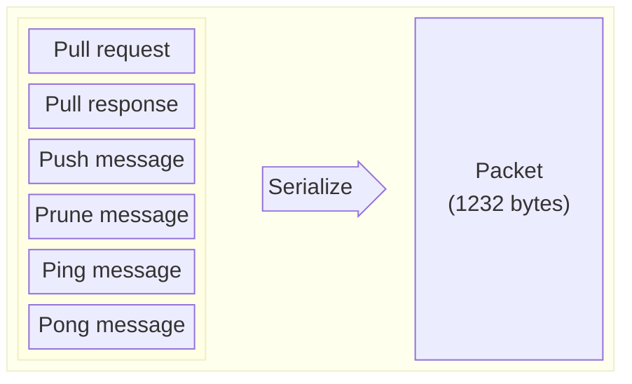
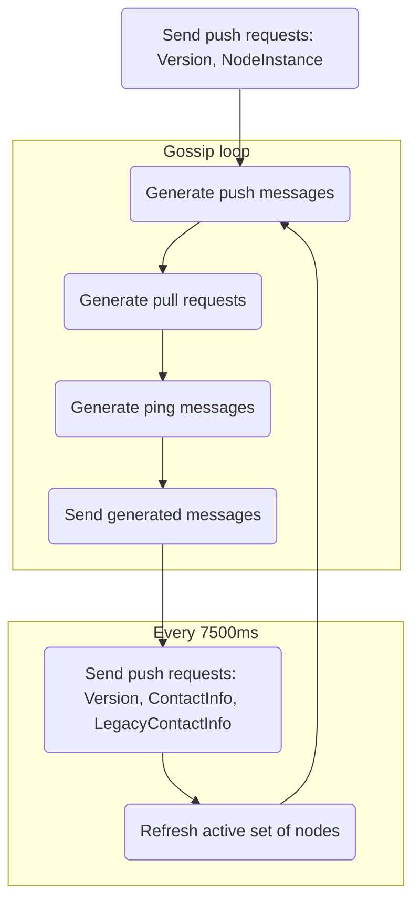

# Gossip protocol

Solana nodes communicate with each other and share data using the gossip protocol. They send messages in a binary form which need to be deserialized. There are 6 types of messages:
* pull request
* pull response
* push message
* prune message
* ping
* pong

Each message contains data specific to its type: values that nodes share between them, filters, pruned nodes, etc. Nodes keep their data in _Cluster Replicated Data Store_ (`crds`), which is synchronized between nodes via pull requests, push messages and pull responses.

## Message format

Each message is sent in a binary form with a maximum size of 1232 bytes (1280 is a minimum `IPv6 TPU`, 40 bytes is the size of `IPv6` header and 8 bytes is the size of the fragment header). 


Data sent in the message is serialized from a `Protocol` type, which can be one of:

| Enum ID  | Message                        | Data                      | Description |
|:--------:|--------------------------------|---------------------------|------------|
| 0 | [pull request](#pullrequest)   | `CrdsFilter`, `CrdsValue` | sent by node to ask for new information |
| 1 | [pull response](#pullresponse) | `Pubkey`, `CrdsValuesList`   | response to a pull request |
| 2 | [push message](#pushmessage)   | `Pubkey`, `CrdsValuesList`     | sent by node to share its data |
| 3 | [prune message](#prunemessage) | `Pubkey`, `PruneData`     | sent to peers with a list of nodes which should be pruned |
| 4 | [ping message](#pingmessage)   | `Ping`                    | a ping message |
| 5 | [pong message](#pongmessage)   | `Pong`                    | response to a ping |




<details>
  <summary>Solana client Rust implementation</summary>

``` rust
enum Protocol
{
    PullRequest(CrdsFilter, CrdsValue),
    PullResponse(Pubkey, [CrdsValue]),
    PushMessage(Pubkey, [CrdsValue]),
    PruneMessage(Pubkey, PruneData),
    PingMessage(Ping),
    PongMessage(Pong)
}
```

</details>

### Type definitions
Fields described in the tables below have their types specified using Rust notation:
* `u8` - 1 byte of unsigned data (8-bit unsigned integer)
* `u16` - 16-bit unsigned integer
* `u32` - 32-bit unsigned integer, and so on...
* `[u8]` - dynamic size array of 1-byte elements
* `[u8; 32]` - fixed size array of 32 elements, with each element being 1 byte
* `[[u8; 64]]` - a two-dimensional array containing arrays of 64 1-byte elements 
* `MyStruct` - a complex type (either defined as a struct or a Rust enum), consisting of many elements of different basic types

The **Size** column in tables contains the size of data in bytes. The size of dynamic arrays contains an additional _plus_ (`+`) sign, e.g. `32+`, which means the array has at least 32 bytes. Empty dynamic arrays always have 8 bytes which is the size of the array header containing array length. 
In case the size of a particular complex data is unknown it is marked with `?`. The limit, however, is always 1232 bytes for the whole data packet (payload within the UDP packet).

#### Data serialization
In the Rust implementation of the Solana node, the data is serialized into a binary form using a [`bincode` crate][bincode] as follows:
* basic types, e.g. `u8`, `u16`, `u64`, etc. - are serialized as they are present in the memory, e.g. `u8` type is serialized as 1 byte, `u16` as 2 bytes, and so on,
* array elements are serialized as above, e.g. `[u8; 32]` array is serialized as 32 bytes, `[u16; 32]` will be 64 bytes,
* dynamically sized arrays have always an 8-byte header containing array length plus bytes of data, therefore empty arrays take 8 bytes,
* [enum types](#enum-types) contain a header with a 4-byte discriminant (tells which enum variant is selected) + additional data
* struct fields are serialized one by one using the rules above.

##### Enum types
Enum types in Rust are more advanced than in other languages. Apart from _classic_ enum types, e.g.:
```rust
enum CompressionType {
    Gzip,
    Bzip2
}
```
it is also possible to create an enum which contains data fields, e.g.:
```rust
enum SomeEnum {
    Variant1(u64),
    Variant2(SomeType)
}

struct SomeType {
    x: u32,
    y: u16,
}
```
In the first case, the serialized object of `CompressionType` enum will only contain a 4-byte header with the discriminant value set to the selected variant (`0 = GZip`, `1 = Bzip2`). In the latter case apart from the header the serialized data will contain additional bytes according to which variant was selected: 
* `Variant1`: 8 bytes
* `Variant2`: 6 bytes (the sum of `x` and `y` fields of `SomeType` struct)

Special care needs to be taken when deserializing such enum as according to the selected variant number of following data bytes may be different.


### Gossip loop



Each node runs a gossip loop where in each iteration the following actions are performed:
* just before the loop starts node sends a push message containing `Version` and `NodeInstance`
* [push messages](#pushmessage), [pull requests](#pullrequest) and ping messages are generated and sent
* values older than the `active_timeout` are purged from `crds`
* old failed inserts are also purged (these are pull responses that failed to be inserted into `crds` - they are preserved to stop the sender from sending back the same outdated payload by adding them to the filter for the next pull request)
* every 7500ms node sends a push request containing `LegacyContactInfo`, `ContactInfo` and `NodeInstance` and refreshes its active set of nodes

### PushMessage
It is sent by nodes who want to share information with others. Nodes gather data and send push messages periodically in the [gossip loop](#gossip-loop):
* node gathers entries from `crds` with timestamps inside the current wallclock window (+/- 30s)
* creates push messages that will be sent to peers from the active set
* pruned nodes are excluded unless entry should be pushed to the prunes too.

A node receiving the message checks for:
* duplication - duplicated messages are dropped. The node responds with a prune message periodically based on the node's stake, inbound peer stake, and timeliness of the peer node
* new data:
    * new information is stored in `crds` and replaces the old value
    * duplicates are tracked in `ReceivedCache`
    * retransmits information to its peers, which are randomly selected such that they have not pruned source addresses of the messages
* expiration - messages are dropped when older than `PUSH_MSG_TIMEOUT` and when `crds` table fills up.

| Data | Type | Size | Description |
|------|:----:|:----:|-------------|
| `Pubkey` | `[u8; 32]` | 32 | a public key of the origin |
| `CrdsValuesList` | [`[CrdsValue]`](#data-shared-between-nodes) | 8+ | a list of values to share  |


### PullRequest
A node sends it to ask the cluster for new information. In the [gossip loop](#gossip-loop) node does the following each iteration:
* collects a list of peers based on their stake (only the highest staked nodes are collected)
* creates bloom filters from `crds` values, purged values, and failed inserts - these are things the node already contains
* divides filters randomly among peers using weights calculated from their stakes - weights are calculated based on the time since last picked and the natural log of the stake weight
* adds a `LegacyContactInfo` value to each pull request which contains the node's ports and addresses
* creates and sends pull requests to peers.

Nodes receiving pull requests:
* filter and insert pull request values into their `crds`
* gather all new values from their `crds`
* filter them using the filters provided in the pull requests
* send `PullResponse` to the origin of the request.

| Data | Type | Size | Description |
|------|:----:|:----:|-------------|
| `CrdsFilter` | [`CrdsFilter`](#crdsfilter) | 37+ | a bloom filter representing things node already has |
| `CrdsValue` | [`CrdsValue`](#data-shared-between-nodes) | ? | a value, usually a `LegacyContactInfo` of the node that sends the pull request containing node socket addresses for different protocols (gossip, tvu, tpu, rpc, etc.) |

#### CrdsFilter

| Data | Type | Size | Description |
|------|:----:|:----:|-------------|
| `filter` | [`Bloom`](#bloom) | 24+ | a bloom filter |
| `mask` | `u64` | 8 | filter mask |
| `mask_bits` | `u32` | 4 | filter mask bits |

#### Bloom
| Data | Type | Size | Description |
|------|:----:|:----:|-------------|
| `keys` | `[u64]` | 8+ | keys |
| `bits` | `[u64]` | 8+ | bits |
| `num_bits_set` | `u64` | 8 | number of bits |

<details>
  <summary>Solana client Rust implementation</summary>

``` rust
struct CrdsFilter {
    filter: Bloom,
    mask: u64,
    mask_bits: u32,
}

struct Bloom {
    keys: Vec<u64>,
    bits: BitVec<u64>,
    num_bits_set: u64,
}
```

</details>

### PullResponse
These are sent in response to a `PullRequest`. They contain filtered values from the node's `crds`. 

Pull responses are processed by recipients according to the responses' timestamps:
* responses that don't exist in the node'   s `crds` or exist and have newer timestamps are inserted into `crds`, their owners `LegacyContactInfo` timestamps are updated in `crds`
* responses with expired timestamps are also inserted, but without updating owner timestamps
* hashes of outdated values that were not inserted into `crds` (value with newer timestamp already exists, or value owner is not present in `crds`) are stored for future as `failed_inserts` to prevent peers from sending them back

| Data | Type | Size | Description |
|------|:----:|:----:|-------------|
| `Pubkey` | `[u8; 32]` | 32 | a public key of the origin |
| `CrdsValuesList` | [`[CrdsValue]`](#data-shared-between-nodes) | 8+ | a list of new values  |


## Data shared between nodes

The `CrdsValue` values that are sent in push messages, pull requests & pull responses contain the signature and the actual shared data:

| Data | Type | Size | Description |
|------|:----:|:----:|-------------|
| `signature` | `[u8; 64]` | 64 | signature of origin |
| `data` | [`CrdsData`](#crdsdata) | ? | data  |

<details>
  <summary>Solana client Rust implementation</summary>

```rust
struct CrdsValue {
    signature: Signature,
    data: CrdsData,
}

enum CrdsData {
    LegacyContactInfo(LegacyContactInfo),
    Vote(VoteIndex, Vote),
    LowestSlot(LowestSlotIndex, LowestSlot),
    EpochSlots(EpochSlotsIndex, EpochSlots),
    LegacyVersion(LegacyVersion),
    Version(Version),
    NodeInstance(NodeInstance),
    DuplicateShred(DuplicateShredIndex, DuplicateShred),
    SnapshotHashes(SnapshotHashes),
    ContactInfo(ContactInfo),
    RestartLastVotedForkSlots(RestartLastVotedForkSlots),
    RestartHeaviestFork(RestartHeaviestFork),
}
```
</details>

### CrdsData
The `CrdsData` is  an enum and can be one of:
| Enum ID | Type |
|:-------:|------|
| 0 | [LegacyContactInfo](#legacycontactinfo) |
| 1 | [Vote](#vote) |
| 2 | [LowestSlot](#lowestslot) |
| 3 | LegacySnapshotHashes |
| 4 | AccountsHashes |
| 5 | EpochSlots |
| 6 | LegacyVersion |
| 7 | Version |
| 8 | NodeInstance |
| 9 | DuplicateShred |
| 10 | SnapshotHashes |
| 11 | ContactInfo |
| 12 | RestartLastVotedForkSlots |
| 13 | RestartHeaviestFork |

<details>
  <summary>Solana client Rust implementation</summary>

```rust
enum CrdsData
{
    LegacyContactInfo(LegacyContactInfo),
    Vote(VoteIndex, Vote),
    LowestSlot(LowestSlotIndex, LowestSlot),
    LegacySnapshotHashes(LegacySnapshotHashes),
    AccountsHashes(AccountsHashes),
    EpochSlots(EpochSlotsIndex, EpochSlots),
    LegacyVersion(LegacyVersion),
    Version(Version),
    NodeInstance(NodeInstance),
    DuplicateShred(DuplicateShredIndex, DuplicateShred),
    SnapshotHashes(SnapshotHashes),
    ContactInfo(ContactInfo),
    RestartLastVotedForkSlots(RestartLastVotedForkSlots),
    RestartHeaviestFork(RestartHeaviestFork),
}
```
</details>

#### LegacyContactInfo
Basic info about the node. Nodes send this message to introduce themselves to the cluster and provide all addresses and ports that their peers can use to communicate with them. 

| Data | Type | Size | Description |
|------|:----:|:----:|-------------|
| `id` | `[u8; 32]` | 32 | public key of the origin |
| `gossip` | [`SocketAddr`](#socketaddr) | 10 or 22 |  gossip protocol address |
| `tvu` | [`SocketAddr`](#socketaddr) | 10 or 22 | address to connect to for replication |
| `tvu_quic` | [`SocketAddr`](#socketaddr) | 10 or 22 | TVU over QUIC protocol |
| `serve_repair_quic` | [`SocketAddr`](#socketaddr) | 10 or 22 | repair service for QUIC protocol |
| `tpu` | [`SocketAddr`](#socketaddr) | 10 or 22 | transactions address |
| `tpu_forwards` | [`SocketAddr`](#socketaddr) | 10 or 22 | address to forward unprocessed transactions |
| `tpu_vote` | [`SocketAddr`](#socketaddr) | 10 or 22 | address for sending votes |
| `rpc` | [`SocketAddr`](#socketaddr) | 10 or 22 | address for JSON-RPC requests |
| `rpc_pubsub` | [`SocketAddr`](#socketaddr) | 10 or 22 | websocket for JSON-RPC push notifications |
| `serve_repair` | [`SocketAddr`](#socketaddr) | 10 or 22 | address for sending repair requests |
| `wallclock` | `u64` | 8 | wallclock of the node that generated that message |
| `shred_version` | `u16` | 2 | the shred version node has been configured to use |

##### SocketAddr
An enum which can be either V4 or V6 socket address.
| Enum ID | Data | Type | Size | Description |
|:-------:|------|:----:|:----:|-------------|
| 0 | `V4` | [`SocketAddrV4`](#socketaddrv4) | 10 | V4 socket address |
| 1 | `V6` | [`SocketAddrV6`](#socketaddrv6) | 22 | V6 socket address |

##### SocketAddrV4
| Data | Type | Size | Description |
|------|:----:|:----:|-------------|
| `ip` | `[u8; 4]` | 4 | ip address |
| `port` | `u16` | 2 | port |

##### SocketAddrV6
| Data | Type | Size | Description |
|------|:----:|:----:|-------------|
| `ip` | `[u8; 16]` | 16 | ip address |
| `port` | `u16` | 2 | port |

<details>
  <summary>Solana client Rust implementation</summary>

```rust
struct LegacyContactInfo {
    id: Pubkey,
    gossip: SocketAddr,
    tvu: SocketAddr,
    tvu_quic: SocketAddr,
    serve_repair_quic: SocketAddr,
    tpu: SocketAddr,
    tpu_forwards: SocketAddr,
    tpu_vote: SocketAddr,
    rpc: SocketAddr,
    rpc_pubsub: SocketAddr,
    serve_repair: SocketAddr,
    wallclock: u64,
    shred_version: u16,
}

enum SocketAddr {
    V4(SocketAddrV4),
    V6(SocketAddrV6)
}

struct SocketAddrV4 {
    ip: Ipv4Addr,
    port: u16,
}

struct SocketAddrV6 {
    ip: Ipv6Addr,
    port: u16
}

struct Ipv4Addr {
    octets: [u8; 4]
}

struct Ipv6Addr {
    octets: [u8; 16]
}
```

</details>

#### Vote
It's a validator's vote on a fork. Contains a one-byte index from the vote tower (range 0 to 31) and vote transaction to be executed by the leader.

| Data | Type | Size | Description |
|------|:----:|:----:|-------------|
| `index` | `u8` | 1 | vote tower index | 
| `from` | `[u8; 32]` | 32 | public key of the origin |
| `transaction`  | [`Transaction`](#transaction) | 59+ | a vote transaction, an atomically-committed sequence of instructions |
| `wallclock`  | `u64` | 8 |  wallclock of the node that generated that message |
| `slot`  | `u64` | 8 |  slot in which the vote was created |


##### Transaction
Contains a signature and a message with a sequence of instructions.

| Data | Type | Size | Description |
|------|:----:|:----:|-------------|
| `signature` | `[[u8; 64]]` | 8+ | list of signatures equal to `num_required_signatures` for the message |
| `message` | [`Message`](#message) | 51+ | transaction message containing instructions to invoke |


 ##### Message

| Data | Type | Size | Description |
|------|:----:|:----:|-------------|
| `header` | [`MessageHeader`](#message-header) | 3 | message header |
| `account_keys` | `[[u8; 32]]` | 8+ | all account keys used by this transaction |
| `recent_blockhash` | `[u8; 32]` | 32 |hash of a recent ledger entry |
| `instructions` | [`[CompiledInstruction]`](#compiled-instruction) | 8+ | list of compiled instructions to execute |

##### Message header

| Data | Type | Size | Description |
|------|:----:|:----:|-------------|
| `num_required_signatures` | `u8` | 1 | number of signatures required for this message to be considered valid |
| `num_readonly_signed_accounts` | `u8` | 1 | last `num_readonly_signed_accounts` of the signed keys are read-only accounts |
| `num_readonly_unsigned_accounts` | `u8` | 1 | last `num_readonly_unsigned_accounts` of the unsigned keys are read-only accounts |

##### Compiled instruction

| Data | Type | Size | Description |
|------|:----:|:----:|-------------|
| `program_id_index` | `u8` | 1 | index of the transaction keys array indicating the program account ID that executes the program |
| `accounts` |`[u8]` | 8+ | indices of the transaction keys array indicating the accounts that are passed to a program |
| `data` | `[u8]` | 8+ | program input data |

<details>
  <summary>Solana client Rust implementation</summary>

```rust
struct Vote {
    from: Pubkey,
    transaction: Transaction,
    wallclock: u64,
    slot: Option<Slot>,
}

type Slot = u64

struct Transaction {
    signature: Vec<Signature>,
    message: Message
}

struct Message {
    header: MessageHeader,
    account_keys: Vec<Pubkey>,
    recent_blockhash: Hash,
    instructions: Vec<CompiledInstruction>,
}

struct MessageHeader {
    num_required_signatures: u8,
    num_readonly_signed_accounts: u8,
    num_readonly_unsigned_accounts: u8,
}

struct CompiledInstruction {
    program_id_index: u8,
    accounts: Vec<u8>,
    data: Vec<u8>,
}
```
</details>

#### LowestSlot
It is the first available slot in Solana [blockstore][blockstore] that contains any data. Contains a one-byte index (deprecated) and the lowest slot number.

| Data | Type | Size | Description |
|------|:----:|:----:|-------------|
| `index` | `u8` | 1 | _deprecated_ | 
| `from` | `[u8; 32]`| 32 | public key of the origin |
| `root` | `u64` | 8 | _deprecated_ |
| `lowest` | `u64` | 8 | the actual slot |
| `slots` | `[u64]` | 8+ | _deprecated_ |
| `stash` | [`[EpochIncompleteSlots]`](#epochincompleteslots) | 8+ | _deprecated_ |
| `wallclock` | `u64` | 8 | wallclock of the node that generated that message |

##### EpochIncompleteSlots

| Data | Type | Size | Description |
|------|:----:|:----:|-------------|
| `first` | `u64` | 8 | first slot number | 
| `compression` | [`CompressionType`](#compressiontype) | 4 | compression type | 
| `compressed_list` | `[u8]` | 8+ | compressed slots list | 

##### CompressionType
Compression type enum.

| Enum ID | Data | Description |
|:-------:|------|-------------|
| 0 | `Uncompressed` | uncompressed | 
| 1 | `GZip` | gzip | 
| 2 |  `BZip2`| bzip2 | 

<details>
  <summary>Solana client Rust implementation</summary>

```rust
struct LowestSlot {
    from: Pubkey,
    root: Slot,
    lowest: Slot,
    slots: BTreeSet<Slot>,
    stash: Vec<EpochIncompleteSlots>,
    wallclock: u64,
}

struct EpochIncompleteSlots {
    first: Slot,
    compression: CompressionType,
    compressed_list: Vec<u8>,
}

enum CompressionType {
    Uncompressed,
    GZip,
    BZip2,
}
```
</details>


[bincode]: https://github.com/bincode-org/bincode/blob/trunk/docs/spec.md
[blockstore]: https://docs.solanalabs.com/validator/blockstore