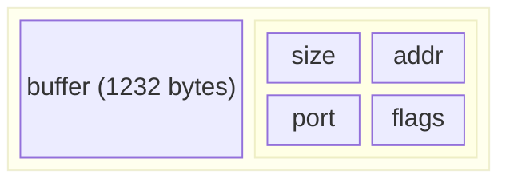
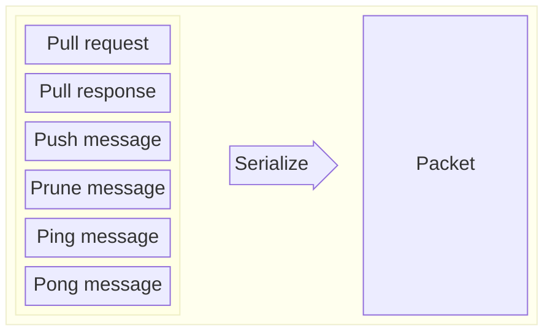

# Gossip protocol

This document describes the gossip protocol without implementation details which can be found [here](/implementation-details.md).

Solana nodes communicate with each other and share data using the gossip protocol. They send messages in a binary form which nodes need to deserialize. There are 6 types of messages:
* pull request
* pull response
* push message
* prune message
* ping
* pong

Each message contains data specific to its type: values that nodes share between them, filters, pruned nodes, etc. Nodes keep their data in [_Cluster Replicated Data Store_ (`crds`)](/implementation-details.md#cluster-replicated-data-store) which is synchronized between them via pull requests, push messages and pull responses.

## Message format
Packet:



Each message is sent in a binary form with a maximum size of 1232 bytes (1280 is a minimum `IPv6 TPU`, 40 bytes is the size of `IPv6` header and 8 bytes is the size of the fragment header). Apart from the actual data, packet contains additional metadata:

 * `size` - size of the packet
 * `addr` - address of the origin
 * `port` - port of the origin
 * `flags` - additional flags

<details>
  <summary>Rust implementation</summary>

```rust
struct Packet {
    buffer: [u8; 1232],
    meta: Meta,
}

struct Meta {
    size: usize,
    addr: IpAddr,
    port: u16,
    flags: PacketFlags,
}

PacketFlags {
    const DISCARD        = 0b0000_0001;
    const FORWARDED      = 0b0000_0010;
    const REPAIR         = 0b0000_0100;
    const SIMPLE_VOTE_TX = 0b0000_1000;
    const TRACER_PACKET  = 0b0001_0000;
    const ROUND_COMPUTE_UNIT_PRICE = 0b0010_0000;
}
```

</details>


Data sent in the message is serialized from a `Protocol` type, which can be one of:
* [pull request](#pullrequest)
* [pull response](#pullresponse)
* [push message](#pushmessage)
* [prune message](#prunemessage)
* [ping message](#pingmessage)
* [pong message](#pongmessage)


<details>
  <summary>Rust implementation</summary>

``` rust
enum Protocol
{
    PullRequest(CrdsFilter, CrdsValue),
    PullResponse(Pubkey, [CrdsValue]),
    PushMessage(Pubkey, [CrdsValue]),
    PruneMessage(Pubkey, PruneData),
    PingMessage(Ping),
    PongMessage(Pong)
}
```

</details>

### PullRequest

Is sent by node to ask the cluster for new information. It contains a bloom filter with things node already has. Nodes receiving pull requests gather all new values from their `crds`, filter them using provided filters and send `PullResponse` to the origin of the request.

`PullRequest` message contains two values:
  * `CrdsFilter` - a bloom filter representing things node already has
  * `CrdsValue` - a [value](#data-shared-between-nodes), usually a `LegacyContactInfo` of the node who send the pull request containing nodes socket addresses for different protocols (gossip, tvu, tpu, rpc, etc.)

### PullResponse
These are sent in response to `PullRequest` and contain:
  * `Pubkey` - a public key of the origin
  * `[CrdsValue]` - a list of new values 

### PushMessage
It is sent by nodes who want to share information with others. Node receiving the message checks for:
- duplication - duplicated messages are dropped, node responses with prune message if message came from low staked node
- new data:
    - new information is stored in `crds` and replaces old value
    - stores message in `pushed_once` which is used for detecting duplicates
    - retransmits information to its peers
- expiration - messages older than `PUSH_MSG_TIMEOUT` are dropped

The `PushMessage` contains:
  *  `Pubkey` - a public key of the origin
  * `[CrdsValue]` - list of values to share