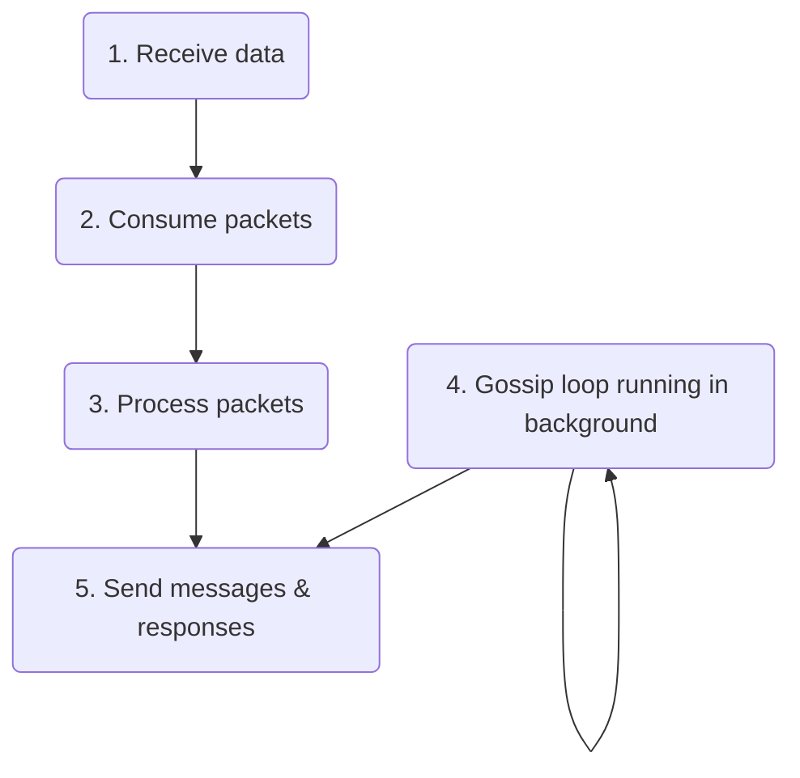
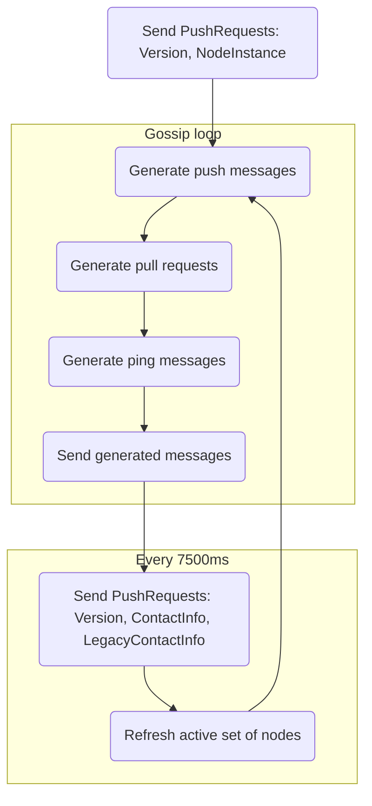

# Gossip protocol implementation details

This document describes how the gossip protocol is implemented in Solana Rust client. Each Solana nodes participates in gossip in one of two modes:
* `gossip` mode - node binds to specified UDP socket and fully participates in the gossip
* `spy` mode - node binds to an UDP socket at random port in range [8000-10000] and spies on gossip via pull requests

Nodes run several threads which are consuming & processing packets, running gossip loop and sending & receiving packets via UDP sockets. Threads communicate with each other using a thread-safe multi-consumer multi-producer channels for message passing.

## Data management in gossip service

Managing of data is divided into several steps, each running on a separate thread:

1. [Receiving](#receiving-data) data over UDP sockets - data is gathered in a batch and processed further
2. [Consuming](#consuming-packets) of the packets - data is deserialized, sanitized and verified before processing
3. [Processing](#processing-packets) of the packets - based on the protocol type data is handled in a different way. The [gossip protocol](/gossip-protocol-spec.md) defines following types of messages:
* pull request
* pull response
* push message
* prune message
* ping message
* pong message
4. [Generating](#gossip-loop) pings, push messages and pull messages in the main gossip loop which are sent to peers. 
5. [Sending](#sending-data) responses over sockets. 

### Receiving data 

Packet receiver thread binds to a socket on address 0.0.0.0 and specified port in case of running in `gossip` mode or at random port in 8000-10000 range in case of `spy` mode. Packets are collected into a packet batch that is further processed. 

### Consuming packets

Data packets are being checked before further [processing](#processing-packets). First packets are [deserialized](#deserialization) from the binary form into a `Protocol` type and then [sanitized](#data-sanitization) and [verified](#data-verification).

#### Deserialization 

Packets are deserialized into a `Protocol` type defined in the [gossip protocol](/gossip-protocol-spec.md).

#### Data sanitization

Sanitization excludes signature-verification checks as these are performed in the next step. Sanitize checks include but are not limited to:

* all index values are in range
* all values are within their static min/max bounds

#### Data verification

Verification is handled differently according to type of the message:

* pull request - public key of the incoming value is verified,
* pull response, push message - each value from the incoming array is verified as above, only verified values are processed further
* prune message - public key of the incoming value is verified,
* ping - token is verified
* pong - hash of received ping token is verified

Only successfully verified packets are processed in the next step.

### Processing packets

Packets are filtered by shred version - only packets from origin with the same shred version as processing node are retained. There are 3 data types that are always retained too - `ContactInfo`, `LegacyContactInfo` and `NodeInstance`. 

#### Processing pull requests

* Self pull requests are ignored. 
* Pull reqest values:
  * are filtered - in case of duplicates, only the most recent ones are kept
  * are inserted into `crds`
* Pull requests are checked if coming from a valid address and if the address has responded to a ping request
  * ping packets are generated for addresses that need to be pinged
* Pull responses are generated:
  * wallclock is checked for each pull request - too old requests are skipped
  * `crds` values are filtered out using provided filters from pull requests 
    * values with newer wallclock than pull reqest sender are also filtered out
  * for certain types (`LowestSlot`, `LegacyVersion`, `DuplicateShred`, `RestartHeaviestFork`, `RestartLastVotedForkSlots`) only `crds` values associated with nodes with enough stake (>= 1 sol) are retained
* Pull responses and pings are sent
#### Processing pull responses

Pull responses are processed according to their timestamps:
* responses that don't exist in the nodes `crds` or exist and have newer timestamps are inserted into `crds`, their owners `LegacyContactInfo` timestamps are updated in `crds`
* responses with expired timestamps are also inserted, but without updating owner timestamps
* hashes of outdated values which were not insterted into `crds` (value with newer timestamp already exists, or value owner is not present in `crds`) are stored for future as `failed_inserts` to prevent peers to send them back

#### Processing push messages
* fresh enough values and not existing in `crds` are inserted, in case of the types below values are additionaly stored in separate lists/maps:
  * `LegacyContactInfo` - node info and its shred version
  * `Vote` - votes
  * `EpochSlots` - epoch slots
  * `DuplicateShred` - duplicated shreds
* in case value already exists in `crds` it is checked for duplication - if new value has a newer timestamp the existing one is updated
* for each origin of the push message a list of its peers is checked - peers with too low stake will be [pruned](https://github.com/solana-labs/solana/issues/3214)
* for each origin prune messages are generated and sent
* push messages are broadcasted further to node peers - peers are randomly selected such that they have not pruned source addresses of the messages
  * for certain types (`LowestSlot`, `LegacyVersion`, `DuplicateShred`, `RestartHeaviestFork`, `RestartLastVotedForkSlots`) only `crds` values associated with nodes with enough stake (>= 1 sol) are retained

#### Processing prune messages
* expired messages are ignored
* each entry from the list of prunes is added to the bloom filter - no more push messages from such nodes will be sent to nodes peers

#### Processing ping messages

For each ping a new pong message is created. These are then sent back to origins.

#### Processing pong messages

Each pong message is stored in a ping cache. 

### Gossip loop

The gossip loop runs in a separate thread. Each iteration the following steps are performed:

* before loop starts node sends a push message containing `Version` and `NodeInstance`
* push messages are generated:
  * all entries from `crds` with timestamps inside current wallclock window are gathered 
  * for each entry nodes from active set are collected; pruned nodes are excluded unless entry should be pushed to the prunes too
  * list of push messages is created - each collected node will have a list of `crds` values associated
  * entries of below types will be dropped if their origins stake is below required value (currently 1 sol):
    * `LowestSlot`
    * `LegacyVersion`
    * `DuplicateShred`
    * `RestartHeaviestFork`
    * `RestartLastVotedForkSlots`
* pull requests are generated:
  * list of valid (shred version matches or equals 0) and active (updated `crds` within 60 seconds from now) gossip nodes is collected
  * for nodes which should be pinged (ones not pinged yet, or if cached pong is too old) a list of ping requests is created
  * from each gossip address only nodes with highest stake are kept in the list
  * for each node weight is calculated as follows:
    `stake = min(node_self_stake, node_stake[i]) / LAMPORTS_PER_SOL`
    `weight = 64 - stake.leading_zeros()`
    `weight = pow(weight + 1, 2)`
    where: 
    * `node_self_stake` - stake of "our" node, 
    * `node_stake[i]` - stake of i-th node from the list,
    * `stake.leading_zeros()` - leading zeros in the binary representation of the `stake` value (`u64` type)
  * `crds` filters are created from `crds` values, purged values and failed inserts
  * filters are divided among peers selected randomly using weights calculated above - the higher nodes weight, the more filters will be associated with it
  * additional randomly selected node which was not discovered yet is added to the list of nodes with all filters associated
  * a pull request list is created and mapped into list of nodes
* push messages, pull requests and ping messages are sent
* values older than specified timeout are purged from `crds`
* old failed insterts are also purged (these are pull responses which failed to be inserted into `crds` - they are preserved to stop sender sending back the same outdated payload by adding them to the filter for next pull request)
* every 7500ms:
  * node sends a push requests containing the following data: `LegacyContactInfo`, `ContactInfo`, `NodeInstance`,
  * node refreshes its active set of nodes:
    * list of valid (shred version matches or equals 0) and active (updated `crds` within 60 seconds from now) gossip nodes is collected
    * for nodes which should be pinged (ones not pinged yet, or if cached pong is too old) a list of ping requests is created
    * from each gossip address only nodes with highest stake are kept in the list
    * set of active nodes is rotated
    * pings are sent

### Sending data

Messages are serialized to a binary form and sent to peers via UDP sockets.

## Cluster Replicated Data Store

Cluster Replicated Data Store (`crds`) is a data store of all values nodes share with each other. Each node synchronizes its `crds` via the gossip protocol. Data is stored in a single map of `CrdsValueLabel(Pubkey) -> CrdsValue`, where many `CrdsValueLabel` labels are mapped to a single `Pubkey`.

