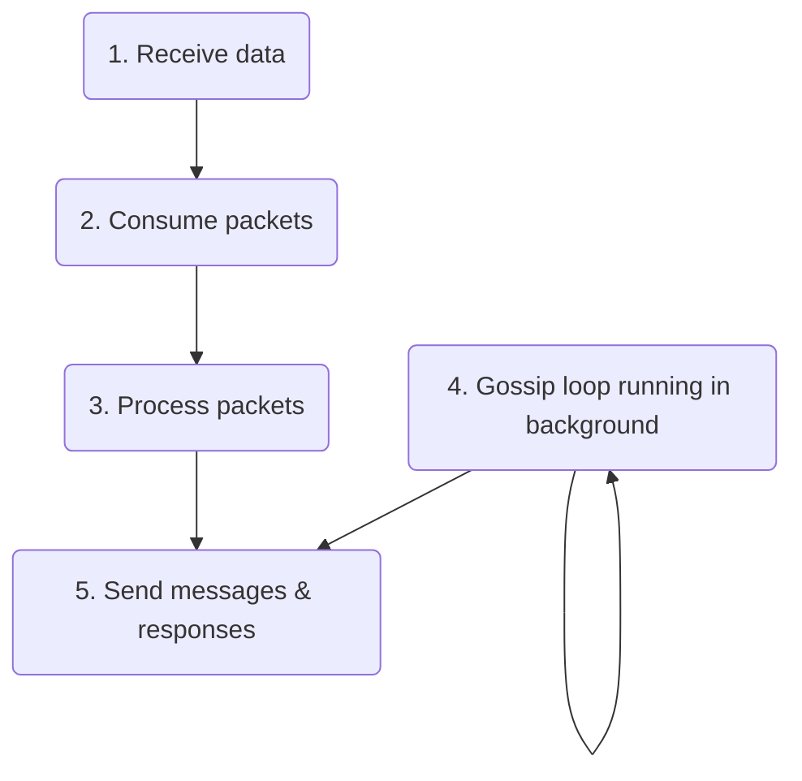
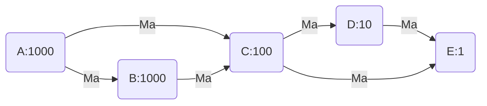

# Gossip protocol implementation details

Solana nodes use gossip protocol to exchange data. They send messages to the cluster whenever they have new data to share and ask the cluster for new data they are missing. Gossip runs on a well-known UDP/IP port or a port in a well-known range. When a node joins the cluster it advertises itself to others where to find its gossip endpoint.

Each Solana node participates in gossip in one of two modes:
* `gossip` mode - node binds to specified UDP socket and fully participates in the gossip
* `spy` mode - node binds to a UDP socket at a random port in a range [8000-10000] and spies on gossip via pull requests

> [!Tip]
> **Naming conventions used in this document**
> - _Node_ - a validator running the gossip
> - _Peer_ - a node sending or receiving messages from the current node we're talking about
> - _Origin_ - node, the original creator of the message
> - _Cluster_ - a network of validators with a leader that produces blocks
> - _Leader_ - node, the leader of the cluster in a given slot
> - _Shred_ - is the smallest portion of block produced by a leader
> - _Shred version_ - a cluster identification value
> - _Fork_ - a fork occures when two different blocks got chained to the same parent block (e.g. next block is created before the previous one was completed)
> - _Epoch_ - it is a length of certain amount of blocks (_slots_) in which the validator schedule is defined
> - _Slot_ - the period of time for which each leader ingests transactions and produces a block

## Data management

When a Solana node receives data from a peer it processes it in several steps:



1. [Receives](#receiving-data) data in a binary form over UDP sockets - data is gathered in a batch of packets and processed further
2. [Consumes](#consuming-packets) packets - they are deserialized into messages, sanitized and verified before processing
3. [Processes](#data-processing) messages - they are filtered, the incoming values are stored in the node's internal storage, and in some cases, responses are generated
4. Generates pings, push and pull messages in the main gossip loop which are sent to peers. 
5. Sends responses over sockets - messages are serialized to a binary form and sent to peers via UDP sockets.

### Receiving data from cluster
Node binds to a UDP socket on a specified port in case of running in `gossip` mode or at random port in the 8000-10000 range in case of `spy` mode. When a node connects to the cluster and advertises itself it will start receiving data from other nodes. Received data is collected into a packet batch that is further processed. 

### Consuming packets

Data packets are being checked before further [processing](#data-processing). First, packets are [deserialized](#deserialization) from the binary form into a `Protocol` type, and then [sanitized](#data-sanitization) and [verified](#data-verification).

#### Deserialization 

Packets are deserialized into one of 6 message types:
* [pull request](#pull-responses)
* [pull response](#pull-responses)
* [push message](#push-messages)
* [prune message](#pruning-nodes)
* [ping message](#ping-and-pong-messages)
* [pong message](#ping-and-pong-messages)

#### Data sanitization

Sanitization excludes signature-verification checks as these are performed in the next step. Sanitize checks include but are not limited to:

* all index values are in the range
* all values are within their static min/max bounds

#### Data verification

Verification is handled differently according to the type of message:

* pull request - the public key of the incoming value is verified,
* pull response, push message - each value from the incoming array is verified as above
* prune message - the public key of the incoming value is verified,
* ping - token is verified
* pong - hash of received ping token is verified

Only successfully verified packets are processed in the next step.

## Data processing

Once messages are sanitized and verified, the node starts processing them. First, messages are filtered by shred version - if the message is coming from a node with a different shred version it is ignored unless it contains one of the data types: `ContactInfo`, `LegacyContactInfo` and `NodeInstance`.

Values from filtered messages are stored in the [_Cluster Replicated Data Store_](#crds), `crds`. Based on the type of received message node will perform additional actions, e.g. collect data from its `crds` and produce a pull response, generate a pong message or update its push active set of nodes. These are described in detail in the next chapters.


### Crds

Each node stores the data it received or produced in the _Cluster Replicated Data Store_, `crds`. The `crds` contains a table which is an index map of `CrdsValueLabel` and `VersionedCrdsValue`. The `CrdsValueLabel` is an enum type whose elements store the origin pubkey and correspond to the gossip protocol types (`Vote`, `NodeInstance`, etc.). This means there will be only one of each data type stored in `crds` per pubkey. The `VersionedCrdsValue` stores the `CrdsValue` with additional metadata, like the timestamp when the value was updated or its hash.

```rust
struct Crds {
  /// Stores the map of labels and values
  table: IndexMap<CrdsValueLabel, VersionedCrdsValue>,
  //...
}

struct VersionedCrdsValue {
  ordinal: u64,
  pub value: CrdsValue,
  pub(crate) local_timestamp: u64,
  pub(crate) value_hash: Hash,
  num_push_dups: u8,
}

enum CrdsValueLabel {
  LegacyContactInfo(Pubkey),
  Vote(VoteIndex, Pubkey),
  LowestSlot(Pubkey),
  LegacySnapshotHashes(Pubkey),
  EpochSlots(EpochSlotsIndex, Pubkey),
  AccountsHashes(Pubkey),
  LegacyVersion(Pubkey),
  Version(Pubkey),
  NodeInstance(Pubkey),
  DuplicateShred(DuplicateShredIndex, Pubkey),
  SnapshotHashes(Pubkey),
  ContactInfo(Pubkey),
  RestartLastVotedForkSlots(Pubkey),
  RestartHeaviestFork(Pubkey),
}
```

When the node receives a new `CrdsValue` it stores it in the `crds` table by creating a new `VersionedCrdsValue` or updating the existing one (in case updated data was received) and keeps its `crds` table index. Then the value is hashed, and the hash and the `crds` index are stored in a separate structure called `CrdsShards`. This structure holds a vector `shards` and `shard_bits` which is a fixed value set to 12 currently. The `shard_bits` tells how many first bits of the `CrdsValue` hash should be used to partition the hashes in the `shards` vector. The `shards` vector can have up to 4096 elements. Each `shards` element is an index map of a `CrdsValue` index in the `crds` table and its hash. 

```rust
struct CrdsShards {
  shards: Vec<IndexMap<usize, u64>>,
  shard_bits: u32,
}
```

_Example_:
A node inserts a `CrdsValue` into `crds` table. The `crds` returns the index under which the value was inserted, `crds_index`. Then, the node calculates `CrdsValue`'s hash - its first 12 bits are equal to e.g. `000001000011`, which is 67 . Finally, the hash and the `crds_index` are stored in the `shards` vector at index 67.

The `CrdsShards` structure is used for a fast search of `CrdsValue`s when building a bloom filter for a pull request, or when collecting missing data for a node that sent us a pull request.

### Push messages

Push messages are the heart of the gossip protocol. Each node that wants to share information with others in the cluster sends a push message, which is then propagated further by its peers. 

Push messages are created periodically. Node tracks a `push_cursor` which represents the cursor value of the last pushed `CrdsValue` into `crds`. When a node wants to send a push message it gets all newly pushed data from `crds` since the last position of the `push_cursor`, collects peers from its active set of nodes, and creates and sends push messages to them. 

Some peers might have pruned the origin node (more on that below), in which case they are excluded from the list of message recipients. Unless the sent data type is `NodeInstance`, which is always sent to every peer even if the origin of the message is pruned.

#### Processing push messages

When a node receives a push message it does the following:
* inserts new values into `crds` if their timestamp is within 30 seconds of the current node's wallclock
* if a value already exists in `crds` it is updated if the timestamp of the updated value is newer
* updates scoring in [receive cache](#receive-cache)
* propagates push messages further in the cluster as described below
* for certain data types (`LowestSlot`, `LegacyVersion`, `DuplicateShred`, `RestartHeaviestFork`, `RestartLastVotedForkSlots`) push messages are propagated further only if their origin has any stake.

#### Propagating push messages over a cluster

Consider the following cluster:

There are 5 nodes in the cluster with different stakes: node A with 1000 stake, B with 1000 stake, C with 100 stake and so on. Node A sends a message, `Ma`, which is propagated through the network by its peers.

Some nodes may receive the same message multiple times, e.g. node C will receive `Ma` from both A and B. In such a case the message from A will come faster than from B (fewer hops), so B will be informed to not send any messages to C originating from A anymore (C will ignore them anyway). In other words, C will prune node A and to do that it will send a prune message to node B.

##### Push active set of nodes

Each node holds a _push active set of nodes_. It is a 25-element array, where each element, a `PushActiveSetEntry`, contains an index map of node public keys and bloom filters [containing pruned nodes](#pruning-nodes).

```rust
struct PushActiveSet([PushActiveSetEntry; 25])
struct PushActiveSetEntry(IndexMap<Pubkey, ConcurrentBloom<Pubkey>>);
```

Every 7500ms the nodes are rotating their active set of nodes:
1. For every i-th node, a bucket is calculated based on a node's stake: `bucket[i] = min(log2(node_stake[i]),24)`.
2. For every active set entry k (k=[0, 24]) weights of nodes are calculated: `weight[i] = (min(bucket[i], k) + 1)^2`.
3. Nodes in every k-th active set entry are weight-shuffled and the first 12 of them are inserted into the active set entry index map with empty bloom filters.

Before sending the push message further a node first calculates the stake: `min(node_stake, origin_stake)`, where `node_stake` is the stake of the node that received the message, `origin_stake` is the stake of the message origin node. The calculated stake corresponds to a bucket in the push active set nodes. For each peer found at a given push active set entry from the selected bucket, the node checks whether the origin of the push message was not pruned by this peer by checking its bloom filter. If yes the peer is filtered out - it will not receive the message (in the example above node A was pruned by C so B will not send it a message). Otherwise, a peer is collected. Finally, a list of push messages is created for no more than a `fanout` (9) amount of collected peer. 

This algorithm guarantees that:
* nodes with higher stake will more likely send the message to their higher-staked peers
* nodes with lower stake will send the message to randomly selected peers from the whole pool
* messages originating from higher-staked nodes will more likely be sent to higher-staked peers
* messages originating from lower-staked nodes will be sent to randomly selected peers from the whole pool.

##### Receive cache

Nodes store information about received messages in the `ReceivedCache` - it's a map of message origins and `ReceivedCacheEntry` (RCE) which is defined as:
```rust
struct ReceivedCache(LruCache<Pubkey, ReceivedCacheEntry>

struct ReceivedCacheEntry {
  nodes: HashMap<Pubkey, Score>,
  num_upserts: usize
}

type Score = usize;
```
Whenever a new message from a given origin comes from a peer, the peer's `score` and `num_upserts` in RCE are incremented. The next peer sending the same message will also have its `score` incremented. The `num_upserts` will not be updated though as this value only increases once every new message from a given origin comes. For every next peer sending the same message from this origin, the `score` will remain unchanged. When the number of `num_upserts` reaches a defined threshold (20 currently), nodes with the lowest score will be pruned:
* node stakes are summed up starting from the highest score node and going down the list to nodes with lower score
* when the sum of stakes reaches a defined fraction of the node's own stake: `sum > min(node_stake, origin_stake) * 0.15`, all the remaining nodes, that is nodes whose stake was not summed up yet, are pruned.

### Pull requests

Nodes are constantly sending pull requests to obtain data they don't contain. To avoid receiving data the node already contains, it creates a list of `CrdsFilter`s which are inserted into pull requests. Each `CrdsFilter` contains a bloom filter with hashes of data the node already possesses - `CrdsValue`s from `crds`, purged values, and failed inserts. Bloom filter is a very fast filter used for checking whether it contains particular data. It has however some range of false positives - it can say a given data exists in the filter when it actually isn't.

```rust
struct CrdsFilter {
    pub filter: Bloom<Hash>,
    mask: u64,
    mask_bits: u32,
}
```

Instead of creating one big bloom filter with all `Crdsvalue`s from the `crds` table,  the node partitions its data into multiple bloom filters. The `mask_bits` value in `CrdsFilter` determines how many first bits of a `CrdsValue` hash will be used to partition the values over filters. 

> _Example_
> The `mask_bits` value equals 3. There will be `2^3=8` `CrdsFilter`s created. Filter with `mask=000`  will contain all hashes that start with `000` bits. The one with `mask=001` will contain all hashes starting from `001`, and so on.


The `mask_bits` param is calculated as: 

```
mask_bits = max(log2(num_items / max_items), 0.0)
```
where `num_items` is the number of current items we want to insert into the filter and `max_items` is the maximum number of items that can be inserted. 

The `CrdsFilter`s are partitioned between peers selected randomly using their weights calculated as follows: 
    
  ```
    stake = min(node_stake, peer_stake[i])
    weight = (log2(stake) + 1)^2
  ```

  where: 
  * `node_stake` - stake of "our" node, 
  * `peer_stake[i]` - stake of i-th node from the list.
  
The higher the node's weight, the more filters will be associated with it.

Each pull request contains one of the `CrdsFilter`s from the list and a `CrdsValue`, which is usually a `LegacyContactInfo`. It contains details of the node that sent the pull request - a list of its IP addresses, pubkey and wallclock. 

When a node receives a pull request it inserts the pull request value (`LegacyContactInfo`) into its `crds` (or updates the existing one in case of duplicate). Then, it checks whether the pull request comes from a valid address as a pull response needs to be sent back. Next, the node checks the pull request wallclock value - if it's not within 15 seconds of the current node's wallclock the request is ignored. Otherwise, a node gathers data from the `crds` table and filters it with the provided `CrdsFilter`. Node uses the `mask_bits` value and the `CrdsShards` structure to find the proper hashes of values from `crds`:
1. If `mask_bits=shard_bits=12` the `CrdsFilter` `mask` value can be used directly as an index in the `shards` vector. The node will gather all `CrdsValue`s from `crds` whose hashes belong to that index in `shards` and filter them with the provided bloom filter. Values not existing in the filter will be collected for further processing.

2. If `mask_bits < shard_bits` values are gathered from all `shards` where first `mask_bits` bits of the indices are equal to the `mask` and then they are filtered using the bloom filter.
> _Example_
> If `mask_bits=4`, `shard_bits=12` and `mask=0001` we search for all shards which contain hashes starting with `0001`, e.g. `000100000000...`, `000100000001...`, and so on.

3. If `mask_bits > shard_bits` an index whose all bits match the first `shard_bits` of the `mask` is selected, and then values from that index are filtered such that the first `mask_bits` bits of their hashes are equal to the `mask`. Finally, values are filtered using the bloom filter and collected. 

> _Example_
> `mask_bits=15`, `shard_bits=12`, `mask=000001000000001` - first we search for a shard with an index equal to the first 12 bits of the mask, `000001000000`, which is 64, and then for hashes starting with `000001000000001...` from that shard.

A Few additional checks for collected `CrdsValue`s are performed before pull responses are created: 
* `CrdsValue`s wallclock is checked against the pull request origin wallclock - if a value is newer it is skipped
* if a value is of one of the types: `LowestSlot`, `LegacyVersion`, `DuplicateShred`, `RestartHeaviestFork`, `RestartLastVotedForkSlots` - if it originates from a non-staked node it is skipped

Finally, all remaining `CrdsValue`s values are sent back to the origin of the pull request message in a [pull response](#pull-responses).

### Pull responses

Pull responses contain a list of `CrdsValue`s filtered using the bloom filter provided in a pull request. These are the values that the node sending the pull request was missing in its `crds`.

When a node receives a pull response it processes its list of `CrdsValue`s:
* values that don't exist in the nodes `crds` table or exist and have newer timestamps are inserted into `crds`, their owners `LegacyContactInfo` timestamps are updated in the `crds`
* values with expired timestamps are also inserted, but without updating owner timestamps
* hashes of outdated values that were not inserted into `crds` (value with newer timestamp already exists, or value owner is not present in `crds`) are stored for future as failed inserts to prevent peers from sending them back (they are used when constructing bloom filter for next pull requests).
* values pruned from `crds` table (i.e. overwritten values) are stored as purged values and also used for constructing bloom filter for the next pull requests


### Pruning nodes

When a node receives the same message from the same origin multiple times it sends the prune message to the node from which it received the duplicate. In the example shown in one of the previous chapters node C received a message originating from node A, `Ma`, from both nodes A and B. To avoid receiving such duplicates in the future C sent a prune message to node B with a list of pruned nodes containing A, which says - hey B don't send me messages originating from A anymore. 

The node receiving the prune message will update its active set of nodes and add pruned nodes to the bloom filter of the message origin entry. In the example above node B receiving the prune message will add A into the bloom filters of node C in its active set of nodes. Then, whenever B would like to send a push message to C will first check which message origins are pruned by C by checking the bloom filter. If the push message comes from A, B will not send it to C.

### Ping and pong messages

Nodes constantly ping their peers to see whether they are active. They create a ping message which contains a randomly generated 32-byte token. The peer receiving the ping should respond with a pong message that contains a hash of the received ping token within a certain amount of time. If the peer fails to respond, it will not receive any other message from the node who pinged it. Otherwise, the origin of the ping message will store the received pong in a cache.
