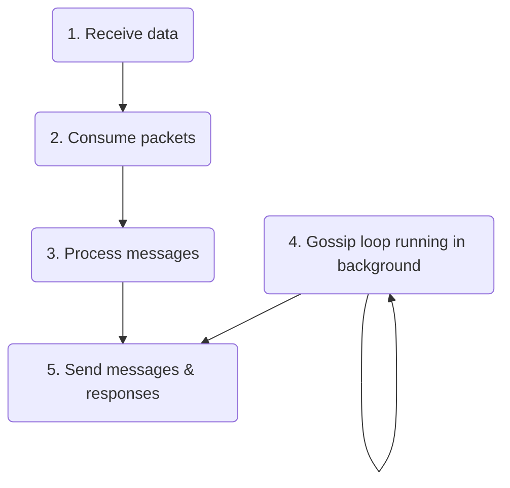
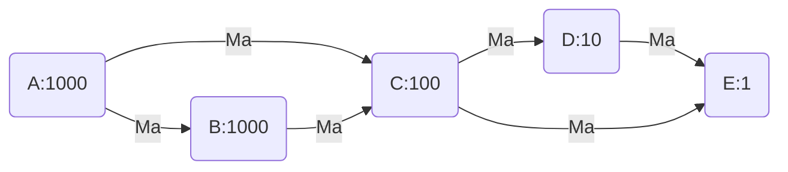
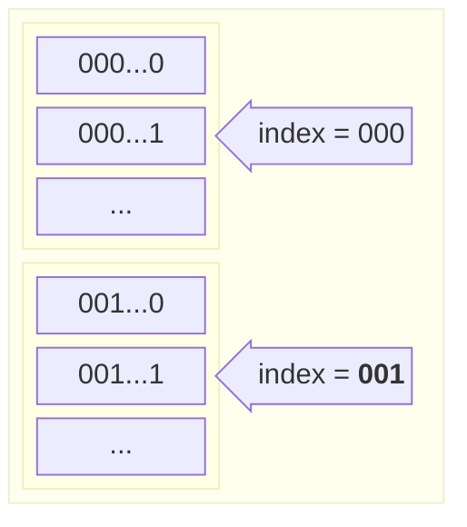
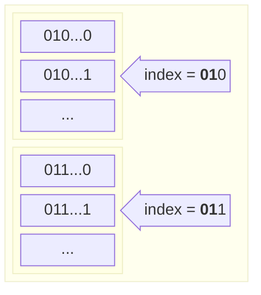
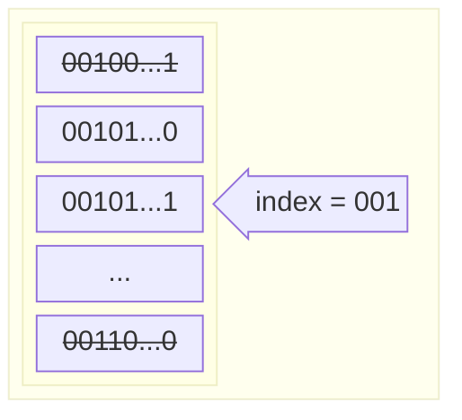

# Gossip protocol implementation details

Solana nodes use gossip protocol to exchange data. They send messages to the cluster whenever they have new data to share and ask the cluster for new data they are missing. Gossip runs on a well-known UDP/IP port or a port in a well-known range. When a node [joins the cluster](#connecting-to-the-cluster) it advertises itself to others where to find its gossip endpoint.

Each Solana node participates in gossip in one of two modes:
* `gossip` mode - node binds to specified UDP socket and fully participates in the gossip
* `spy` mode - node binds to a UDP socket at a random port in a range [8000-10000] and spies on gossip via pull requests

> [!Tip]
> **Naming conventions used in this document**
> - _Node_ - a validator running the gossip
> - _Peer_ - a node sending or receiving messages from the current node we are talking about
> - _Origin_ - node, the original creator of the message
> - _Cluster_ - a network of validators with a leader that produces blocks
> - _Leader_ - node, the leader of the cluster in a given slot
> - _Shred_ - is the smallest portion of block produced by a leader
> - _Shred version_ - a cluster identification value
> - _Fork_ - a fork occures when two different blocks got chained to the same parent block (e.g. next block is created before the previous one was completed)
> - _Epoch_ - it is a length of certain amount of blocks (_slots_) in which the validator schedule is defined
> - _Slot_ - the period of time for which each leader ingests transactions and produces a block
> - _Message_ - the protocol message a node sends to its peers, can be push message, pull request, prune message, etc.

## Connecting to the cluster

When connecting a node to the cluster, the node operator must specify an entrypoint. The entrypoint is the gossip address of the peer the node is going to initially connect to. The node starts up and then advertises itself to the cluster by sending messages to the peer identified by the entrypoint. The node sends:
* two [push messages](#push-messages) containing its own [`Version`](gossip-protocol-spec.md#version) and [`NodeInstance`](gossip-protocol-spec.md#nodeinstance) 
* a [pull request](#pull-requests) that contains the node's own [`LegacyContactInfo`](gossip-protocol-spec.md#legacycontactinfo)

The push messages are [propagated further](#propagating-push-messages-over-a-cluster) to other nodes in the cluster. Soon after that, the node should start receiving [pull responses](#pull-responses), push messages, and [pings](#ping-and-pong-messages) from other nodes. 

When the connection with the cluster is established, the node can fully participate in the gossip - it can update the cluster with its data (push messages) and receive data from its peers through received push messages and by sending pull requests and receiving the corresponding pull responses.

## Data management

When a Solana node receives data from a peer it processes it in several steps:



1. [Receives](#receiving-data-from-cluster) data in a binary form over UDP sockets - data is gathered in a batch of packets and processed further
2. [Consumes](#consuming-packets) packets - the packets are deserialized into messages, sanitized, and verified before processing
3. [Processes](#data-processing) messages - the messages are filtered and stored in the node's internal storage. In some cases, responses are generated
4. Generates pings, push messages, and pull requests in the [gossip loop](#gossip-loop) that are sent to peers. 
5. Sends responses over sockets - messages are serialized to a binary form and sent to peers via UDP sockets.

### Receiving data from cluster
Node binds to a UDP socket on a specified port in case of running in `gossip` mode or at random port in the 8000-10000 range in case of `spy` mode. When in a `spy` mode nodes shred version is set to 0 - that means the node will accept messages from nodes with any shred version. 

When a node connects to the cluster and advertises itself it will start receiving data from other nodes. Received data is collected into a packet batch that is further processed. 

### Consuming packets

Data packets are being checked before further [processing](#data-processing). First, packets are [deserialized](#deserialization) from the binary form into a `Protocol` type, and then [sanitized](#data-sanitization) and [verified](#data-verification).

#### Deserialization 

Packets are deserialized into one of 6 message types:
* [pull request](#pull-responses)
* [pull response](#pull-responses)
* [push message](#push-messages)
* [prune message](#pruning-nodes)
* [ping message](#ping-and-pong-messages)
* [pong message](#ping-and-pong-messages)

#### Data sanitization

Sanitization excludes signature-verification checks as these are performed in the next step. Sanitize checks include but are not limited to:

* all values are within their static min/max bounds, e.g. wallclock value is less than `MAX_WALLCLOCK = 1_000_000_000_000_000`
* all index values are in a specified range - e.g. index value of `EpochSlots` data type is less than `MAX_EPOCH_SLOTS = 255`

#### Data verification

Verification is handled differently according to the type of message:

* pull request - the received `CrdsValue` is verified using the message's signature and sender's public key,
* pull response, push message - each `CrdsValue` from the incoming array is verified using the message's signature and sender's public key of the respective `CrdsValue`
* prune message - the received `PruneData` is verified using the message's signature and sender's public key,
* ping - the received token is verified using the message's signature and the sender's public key
* pong - hash of the received ping token is verified using the message's signature and the sender's public key

Only successfully verified packets are processed in the next step.

## Data processing

Once messages are sanitized and verified, the node starts processing them. First, messages are filtered by shred version - if the message is coming from a peer with a different shred version, or shred version != 0 (peer is in a `spy` mode), it is ignored unless it contains one of the data types: `ContactInfo`, `LegacyContactInfo` and `NodeInstance`.

Values from filtered messages are stored in the [_Cluster Replicated Data Store_](#crds), `crds`. Based on the type of received message node will perform additional actions, e.g. collect data from its `crds` and produce a pull response, generate a pong message or update its push active set of nodes. These are described in detail in the next chapters.


### Crds

Each node stores the data it receives or produces in the _Cluster Replicated Data Store_, `crds`. The `crds` contains a table which is an index map of `CrdsValueLabel` and `VersionedCrdsValue`. The `CrdsValueLabel` is an enum type whose elements store the origin public key and correspond to the gossip protocol types (`Vote`, `NodeInstance`, etc.). This means there will be only one of each data type stored in `crds` per public key. The `VersionedCrdsValue` stores the `CrdsValue` with additional metadata, like the timestamp when the value was updated or its hash.

```rust
struct Crds {
  table: IndexMap<CrdsValueLabel, VersionedCrdsValue>,
  //...
}

struct VersionedCrdsValue {
  ordinal: u64,
  value: CrdsValue,
  local_timestamp: u64,
  value_hash: Hash,
  num_push_dups: u8,
}

enum CrdsValueLabel {
  LegacyContactInfo(Pubkey),
  Vote(VoteIndex, Pubkey),
  LowestSlot(Pubkey),
  LegacySnapshotHashes(Pubkey),
  EpochSlots(EpochSlotsIndex, Pubkey),
  AccountsHashes(Pubkey),
  LegacyVersion(Pubkey),
  Version(Pubkey),
  NodeInstance(Pubkey),
  DuplicateShred(DuplicateShredIndex, Pubkey),
  SnapshotHashes(Pubkey),
  ContactInfo(Pubkey),
  RestartLastVotedForkSlots(Pubkey),
  RestartHeaviestFork(Pubkey),
}
```

When a node receives a new `CrdsValue`, the node:
* stores it in the `crds` table by creating a new `VersionedCrdsValue` or updating the existing one (in case updated data was received)
* keeps the `crds` table index which is created during insertion/update - it points to the `CrdsValue` entry in the table
* hashes the `CrdsValue`
* stores the `crds` index and the hash in a separate structure called `CrdsShards`. 

The `CrdsShards` structure is used for a fast search of `CrdsValue`s when building a Bloom filter for a pull request, or when collecting missing data for a node that sent us a pull request. More on that in the [pull requests](#pull-requests) chapter.

`CrdsShards` contains a vector `shards` and `shard_bits` which is a fixed value set to 12 currently. The `shard_bits` tells how many first bits of the `CrdsValue` hash should be used to partition the hashes in the `shards` vector. The `shards` vector can have up to 2^12 (4096) elements. Each element in the `shards` vector is an index map of a `CrdsValue` index in the `crds` table and the hash of the `CrdsValue`. 

```rust
struct CrdsShards {
  shards: Vec<IndexMap<usize, u64>>,
  shard_bits: u32,
}
```

> _Example_:
>
> A node inserts a `CrdsValue` into `crds` table. The `crds` returns the index under which the value was inserted, `crds_index`. Then the node calculates `CrdsValue`'s hash which first 12 bits are equal to e.g. `000001000011`, which is 67 . Finally, the hash and the `crds_index` are stored in the `shards` vector at index 67.

### Push messages

Push messages are the heart of the gossip protocol. Each node that wants to share information with others in the cluster sends a push message, which is then propagated further by its peers. 

Push messages are created periodically so the nodes can share the latest new data with the cluster. Before sending the push message, the node needs to decide what it wants to share with the cluster. For that reason, the node tracks a `crds_cursor` which represents the cursor value of the last pushed `CrdsValue` from `crds` that was shared with the cluster by the node. When creating new push messages, the node collects all recently inserted data from the `crds` table that is newer than the previous `crds_cursor` tracker. After the messages are sent, the `crds_cursor` is updated accordingly.

Before sending the push message, the node needs to select peers from the [active set of nodes](#push-active-set-of-nodes) that will receive the message.

Some peers might have [pruned](#pruning-nodes) us from sending them messages originating from a specific node. In such cases, these peers are excluded from the list of message recipients.

#### Processing push messages

When a node receives a push message it does the following:
* inserts new values into `crds` if their timestamp is within 30 seconds of the current node's wallclock
* if a value already exists in `crds` it is updated if the timestamp of the new value is newer
* updates scoring in the [receive cache](#receive-cache)
* [propagates push messages](#propagating-push-messages-over-a-cluster) further in the cluster
* for certain data types (`LowestSlot`, `LegacyVersion`, `DuplicateShred`, `RestartHeaviestFork`, `RestartLastVotedForkSlots`) push messages are propagated further only if their origin has any stake.

#### Propagating push messages over a cluster

Consider the following cluster:

There are 5 nodes in the cluster with different stakes: node A with 1000 stake, B with 1000 stake, C with 100 stake and so on. Node A sends a message, `Ma`, which is propagated through the network by its peers.

Some nodes may receive the same message multiple times, e.g. node C will receive `Ma` from both A and B. In such a case the message from A will likely come faster than from B (fewer hops). Since C has now received the same message (`Ma`) from two different nodes, C needs to tell B to stop sending it messages originating from A. In other words, C is _PRUNING_ B for all messages created by A. C prunes B since B's relay of `Ma` is coming in after C has already received `Ma` from A.

##### Push active set of nodes

Each node maintains a push active set of nodes, which is a 25-element array. This array size is chosen based on the log2 distribution of the network's stake, where the largest stakeholder holds approximately 14 million SOL (log(14 million) ≈ 23.7). Each element, a `PushActiveSetEntry`, contains an index map of peer public keys and Bloom filters holding origin public keys. The node uses this index map to check if the origin of the message exists in the peer's corresponding Bloom filter. If yes, the message is not sent to that peer. Otherwise, the message can be sent.

```rust
struct PushActiveSet([PushActiveSetEntry; 25])
struct PushActiveSetEntry(IndexMap<Pubkey, ConcurrentBloom<Pubkey>>);
```

Every 7500ms, nodes rotate their active set of nodes:
1. For every i-th node, a bucket is calculated from the node's stake: `bucket[i] = min(log2(node_stake[i]), 24)`.
2. For every active set entry k (k=[0, 24]) weights of nodes are calculated: `weight[i] = (min(bucket[i], k) + 1)^2`.
3. Nodes in every k-th active set entry are weight-shuffled. The first 12 of them are inserted into the active set entry index map with empty Bloom filters.

To send the push message further, the node does the following:
1. Calculates the bucket: `bucket = log2(min(node_stake, origin_stake))`, where `node_stake` is the stake of the node that received the message, and `origin_stake` is the stake of the message origin node.
2. Goes through the list of peers from a push active set entry at the calculated bucket:
    * for each peer, the node checks whether the origin of the push message was pruned by this peer by checking the peer's Bloom filter for the public key of the message origin:
      * if yes then the peer is filtered out and will not receive the message
      * if no - peer is collected
3. Finally, a list of push messages is created for no more than a `fanout` (9) amount of collected peers.

This algorithm determines the destination node by the minimum of the origin stake and current node stake. The lower the minimum, the more random the destination nodes are. The higher the minimum, the higher the stake of the destination nodes:

| node stake | origin stake | minimum | destination |
|:----------:|:------------:|:-------:|:-----------:|
| high | high | high | high |
| high | low | low | random |
| low | high | low | random |
| low | low | low | random |

##### Receive cache

Nodes store information about received messages in the `ReceivedCache` - it is a map of message origins and `ReceivedCacheEntry` (RCE) which is defined as:
```rust
struct ReceivedCache(LruCache<Pubkey, ReceivedCacheEntry)>

struct ReceivedCacheEntry {
  nodes: HashMap<Pubkey, Score>,
  num_upserts: usize
}

type Score = usize;
```
The RCE structure contains two fields: 
* `nodes` - it is a hash map of node public keys and their score
* `num_upserts` - an integer value that is increased every time a new message from a given origin arrives

When a peer sends us a message from a given origin, its score is updated in RCE, but only if the peer was the first or second to send us a message from this origin.

> _Example_
>
> Take a look at the example from the beginning of this chapter. When node C receives the message `Ma`, it increases the scores of both node A and node B. The `num_upserts` value is also incremented, but only once, as it increases only when the original `Ma` message is received from node A and does not change upon receiving duplicates.
>
>Let's say there is also a node G that sends `Ma` to C, but G sends the message after nodes A and B. In this case, G's score would remain unchanged. The same would be for any other node sending `Ma` to C. Scores are only increased for the first two nodes that sent a message from a given origin. 
>
>After receiving the `Ma` message, C would have three scores stored in RCE for the origin A: for both nodes A and B the score would be 1, for G it would be 0, and the `num_upserts` value would be 1.

When the number of `num_upserts` reaches a defined threshold (20 currently), nodes with the lowest score will be pruned:


```rust
let mut sum = 0;
let mut pos = 0;
let sorted_nodes = sort_nodes_based_on_score(nodes);
for (i, node) in sorted_nodes.iter().enumerate() {
  sum = sum + node.stake;
  if i > 1 && sum > min(stake, origin_stake) * 0.15 {
    pos = i;
    break;
  }
}
prune_nodes(sorted_nodes[pos + 1..]);
```
where:
* `stake` - our node's stake
* `origin_stake` - stake of the origin node.

Let's explain the algorithm above:
* nodes are sorted descending based on their score, if the score is equal nodes are sorted descending by stake
* their stakes are summed up starting from the highest score node and going down the list to nodes with lower score
* we ensure at least 2 nodes are always kept: `if > 1 && ...`
* when the sum of stakes reaches a defined fraction of the node's own stake: `sum > min(node_stake, origin_stake) * 0.15`, we store the current loop iteration index (`pos = i`) and finish the loop
* all left nodes whose stake was not summed up yet, starting from `pos + 1`, are pruned.

### Pruning nodes

When a node wants to prune some of its peers, it sends a prune message. We already know that pruning is based on the receive cache score and peer stake. In the example posted above, node G has a low score in the receive cache of node C for messages originating from node A. Therefore, node C sends a prune message to G with a list of origins to prune (this list includes origin A), which means - hey G do not send me messages originating from A anymore.


The node receiving the prune message will update its active set of nodes and add pruned origins to the Bloom filter corresponding to the public key that sent the prune message. In the above example, node G receiving the prune message will add A into the Bloom filters of peer C in the active set of nodes. Then, whenever G would like to send a push message to C, G will first check which message origins are pruned by C by checking the Bloom filter. If the push message originated from A, G will not send it to C.

### Pull requests

Push message propagation does not guarantee that all nodes in the network receive every message. As a result, nodes need a way to ask their peers for any information they do not have. A node does not know what it does not have. So, the node sends a pull request with data it already has to its peers. The peers will then look over their `crds` table and respond with any data the requesting node is missing.

When creating a pull request, a node needs a way to ensure it does not receive back data it already contains. To do this, the node creates a list of `CrdsFilter`s which are inserted into pull requests. These filters are used by peers to quickly find out what data the requesting node has in its `crds` and what data it is missing. Each `CrdsFilter` contains a Bloom filter with hashes of data the node already possesses - `CrdsValue`s from `crds`, purged values, and failed inserts. Purged values are `CrdsValue`s that were removed from `crds` (e.g. old values), and failed inserts are `CrdsValue`s that were not inserted into `crds`, because for example, they were too old.

A Bloom filter is a fast, probabilistic data structure used to check whether an element is a member of a set. It can quickly determine if an element is definitely not in the set or if it might be in the set. However, Bloom filters have a possibility of false positives, meaning they might indicate that an element is in the set when it actually is not.

```rust
struct CrdsFilter {
    pub filter: Bloom<Hash>,
    mask: u64,
    mask_bits: u32,
}
```

Instead of creating one big Bloom filter with all `CrdsValue`s from the `crds` table, the node partitions its data into multiple Bloom filters. The `mask_bits` value in `CrdsFilter` determines how many first bits of a `CrdsValue` hash will be used to partition the values over filters. 

> _Example_
>
> The `mask_bits` value equals 3. There will be `2^3=8` `CrdsFilter`s created. Filter with `mask=000`  will contain all hashes that start with `000` bits, filter with `mask=001` will contain all hashes starting from `001`, and so on.


The `mask_bits` param is calculated as: 

```
mask_bits = max(log2(num_items / max_items), 0.0)
```
where `num_items` is the number of current items we want to insert into the filter: `CrdsValue`s, purged values and failed inserts. `max_items` is the maximum number of items that can be inserted. 

The node gathers a list of known peers from its `crds` and filters out:
* inactive ones (no message received from that peer in the last 60 seconds)
* peers with a different shred version or shred version != 0
* peers with an invalid gossip address

The set of `CrdsFilter`s is then partitioned into individual `CrdsFilter`s. Each `CrdsFilter` is put into a pull request and sent to a peer that is selected via a weighted random shuffle as follows:
    
  ```
    stake = min(node_stake, peer_stake[i])
    weight = (log2(stake) + 1)^2
  ```

  where: 
  * `node_stake` - stake of "our" node, 
  * `peer_stake[i]` - stake of i-th peer from the list.

  
The higher the node's weight, the more pull requests will be sent to it.

Each pull request contains one of the `CrdsFilter`s from the list and the requesting node's `LegacyContactInfo` as a `CrdsValue`. The node's `LegacyContactInfo` contains details of the node that sent the pull request - a list of its IP addresses, public key, and wallclock. 

When a node receives a pull request, it inserts the pull request value, `LegacyContactInfo`, into its `crds`, or updates the existing one in case of duplicate. Then, it checks whether the pull request comes from a valid address as a pull response needs to be sent back. Next, the node checks the pull request wallclock value - if it is not within 15 seconds of the current node's wallclock, the request is ignored. Otherwise, a node gathers its own data from the `crds` table and checks if the data it holds exists in the provided `CrdsFilter`. 

As was already [explained](#crds), the `CrdsShards` structure holds a `shards` vector whose elements are index maps of `CrdsValue`s indexes in the `crds` table and their hashes. The `shards` vector allows the node to quickly find and filter out `CrdsValue`s that the pull request sender already has in its `crds`. 

For simplicity, let's assume `shard_bits = 3`, `mask_bits = 3` and `mask = 001 = 1` (in reality `shard_bits = 12`, but it is easier to explain using fewer number of bits). The `shards` vector would look like this:



Numbers in the left column represent the hashes (in binary form) of the `CrdsValue`s stored in the `shards` vector. Elements stored at index `000` contain all hashes starting from `000...` (and corresponding indexes of the `CrdsValue`s in the `crds` table), index `001` contains all hashes starting from `001...` and so on. 

The `mask` value from the pull request `CrdsFilter` is equal to `001` - that means we need to get all elements from the `shards` vector located at index `001`. Since every element contains both hash and the index of the `CrdsValue` in the `crds` table we can quickly find the actual `CrdsValue`s in `crds`. 

When all `CrdsValue`s are collected they are filtered using the provided Bloom filter. Elements that do not exist in the filter will be sent back to the pull request sender.

However, there might be the case when `mask_bits < shard_bits` or `mask_bits > shard_bits`:

* `mask_bits < shard_bits` - if e.g. `mask_bits = 2`, `shard_bits = 3` and `mask = 01` we look up all `shards` indexes starting with `01`, e.g. `010`, `011`, `012` and so on, and collect and filter all their elements 



* `mask_bits > shard_bits` - if `mask_bits = 5`, `shard_bits = 3`, `mask = 00101` - first we search for a `shards` index equal to the first 3 bits of the mask, `001`, which is 1, and then for hashes starting with `00101...` from that index.



A few additional checks for collected `CrdsValue`s are performed before pull responses are created: 
* `CrdsValue`s wallclock is checked against the pull request origin wallclock - if a value is newer it is skipped
* if a value is of one of the types: `LowestSlot`, `LegacyVersion`, `DuplicateShred`, `RestartHeaviestFork`, `RestartLastVotedForkSlots` - and it originates from a non-staked node it is skipped

Finally, all remaining `CrdsValue`s values are sent back to the origin of the pull request message in a [pull response](#pull-responses).

### Pull responses

Pull responses contain a list of `CrdsValue`s filtered using the Bloom filter provided in a pull request. These are the values that the node sending the pull request was missing in its `crds`.

When a node receives a pull response, it processes the list of `CrdsValue`s contained within the pull response:
* values that do not exist in the nodes `crds` table or exist and have newer timestamps are inserted into `crds`, and their owner's `LegacyContactInfo` timestamps are updated in the `crds`
* values with expired timestamps are also inserted, but without updating owner timestamps
* hashes of outdated values that were not inserted into `crds` (value with newer timestamp already exists, or value owner is not present in `crds`) are stored for future as `failed inserts` to prevent peers from sending them back (they are used when constructing Bloom filter for next pull requests).
* values pruned from `crds` table (i.e. overwritten values) are stored as `purged values` and also used for constructing Bloom filter for the next pull requests

### Ping and pong messages

Nodes ping their peers from time to time to see whether they are active. They create a ping message which contains a randomly generated 32-byte token. The peer receiving the ping should respond with a pong message that contains a hash of the received ping token within a certain amount of time. If the peer fails to respond, it will not receive any other message from the node who pinged it. Otherwise, the origin of the ping message will store the received pong in a cache.

### Gossip loop
The gossip loop is an infinite loop executed by a node in a separate thread. In this loop, the node generates push messages, pull requests, and pings, while also refreshing its active set of nodes.

## TODOs

* _how often the nodes should send ping messages_
* _how much time the node has to reply to a ping message_
* _how much time the node has to reply to pull request_
* _what happens if the node ignores the prune message and sends the push message anyway to everybody_
* _how often the node needs to send push message (is that also every 7,5 sec?)_
* _more details about each data type_