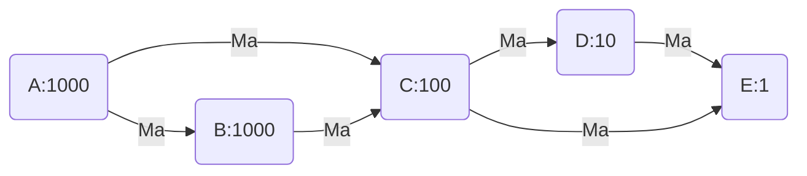
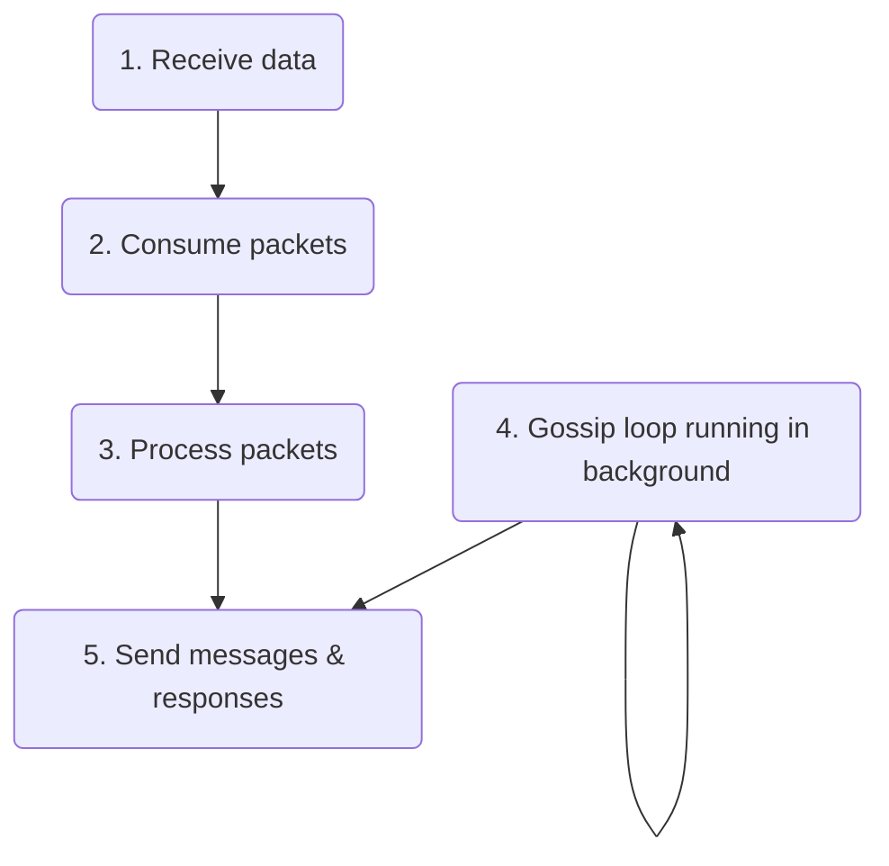
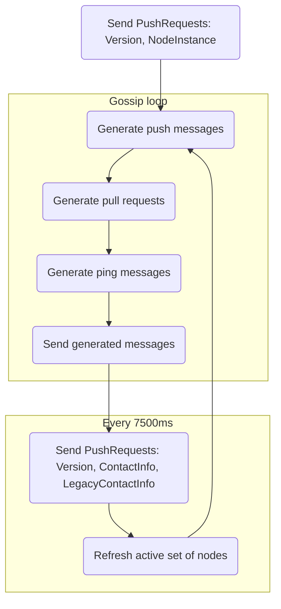

# Gossip protocol implementation details

This document describes how the gossip protocol is implemented in Solana Rust client. Each Solana node participates in gossip in one of two modes:
* `gossip` mode - node binds to specified UDP socket and fully participates in the gossip
* `spy` mode - node binds to a UDP socket at a random port in a range [8000-10000] and spies on gossip via pull requests

Nodes run several threads that are consuming & processing packets, running gossip loops and sending & receiving packets via UDP sockets. Threads communicate with each other using thread-safe multi-consumer multi-producer channels for message passing.

## Propagating push messages over a cluster
Consider the following cluster:

There are 5 nodes in the cluster with different stakes: node A with 1000 stake, B with 1000 stake, C with 100 stake and so on. Node A sends a message, `Ma`, which is propagated through the network by its peers.

Some nodes may receive the same message multiple times, e.g. node C will receive `Ma` from both A and B. In such a case the message from A will come faster than from B (fewer hops), so B will be pruned and should not send any messages to C originating from A (C will ignore them anyway).

Each node holds a _push active set of nodes_. It is a 25-element array, where each element (called a bucket) contains an index map of node public keys and bloom filters [containing pruned nodes](#pruning-nodes). Nodes are partitioned over buckets based on their stake: `min(log2(nodes_stake), 24)`.

When a node receives a push message it first calculates the stake: `min(node_stake, origin_stake)`. It is then used to get the proper entry from the push active set. Each such entry contains up to 12 nodes with bloom filters assigned. If a node was already pruned by a potential message recipient for messages coming from a given origin (e.g. B was pruned by C for sending messages from A in the above example) the recipient is filtered out, unless a given value should be pushed by the prunes too (e.g. `NodeInstance`). Otherwise, a node is collected. Finally, a list of push messages is created for no more than `fanout` (9) amount of collected nodes. 

The algorithm above guarantees that nodes with higher calculated stake will more likely send the message to their higher-staked peers. Nodes with lower calculated stake will send the message to randomly selected peers from the whole pool.

### Receive cache

Nodes store information about received messages in the `RecievedCache` - it's a map of message origins and `RecievedCacheEntry` (RCE) which is defined as:
```rust
struct RecievedCacheEntry {
  nodes: HashMap<Pubkey, Score>,
  num_upserts: usize
}

type Score = usize;
```
Whenever a new message of a given origin comes from a node, its score and `num_upserts` in RCE are incremented. Actually, the second node sending the same message will also have its score incremented (but not `num_upserts`). For every next node sending the same message from this origin, the score will remain unchanged. When the number of `num_upserts` reaches a defined threshold (20 currently), nodes with the lowest score will be pruned:
* node stakes are summed up starting from the highest score node and going down the list to nodes with lower score
* when the sum of stakes reaches a defined fraction of the node's own stake (15%) all the remaining nodes (that is nodes whose stake was not summed yet) are pruned.

## Getting missing data from the cluster
Each node stores its data in the Cluster Replicated Data Store, `crds` (link here!). Nodes are constantly sending pull requests to obtain data they don't contain. To avoid receiving duplicates pull request contains a list of bloom filters with hashes of data the node already possesses. Bloom filter (link here) is a very fast filter that checks whether it contains particular data. It has however some range of false positives - it can say a given data exists in the filter when it actually isn't.

For every data that is stored in `crds` its hash is stored in a `CrdsShards`. This is a structure holding vector `shards` and `shard_bits` which is a fixed value set to 12 currently, that tells how many first bits of a `crds` value hash should be used to partition the hashes in the `shards` vector. So, whenever new data is stored in `crds`, it is hashed and the first 12 bits of the hash are used as an index in the `shards` vector, below which the hash and the `crds` data index are stored. 

When the bloom filter list is created, first its `mask_bits` is calculated as `((num_items / max_items).log().ceil()).max(0.0)`, where `num_items` is the number of current items we want to insert into the filter and `max_items` is the maximum number of items that can be inserted. The `mask_bits` value tells how many first bits of a value hash are used to calculate the index in the bloom filter list. Each value is then inserted into an appropriate filter based on the value's hash. Each filter contains a `mask` value which is an index calculated from the first `mask_bits` value of a hash. So for example, a filter with `mask = 5` and `mask_bits = 8` will contain all hashes whose first 8 bits are equal to value 5.

Bloom filters are partitioned between randomly selected nodes. When a node receives a pull request it needs to gather data from `crds` and filter it using the provided filters. Node uses the `mask_bits`  value and `CrdsShards` to find the proper hashes of values from `crds`. There are 3 cases possible here:
1. The `mask_bits` value equals 12 which is the same as `shard_bits` - in this case, the filter `mask` value can be used directly as an index in the `shards` vector. The node will gather all values from `crds` whose hashes belong to that index and filter them with the provided bloom filter. Values not existing in the filter will be sent back to the message origin in a pull response.

2. The `mask_bits` value is smaller than `shard_bits` - values are gathered from all `shards` which first `mask_bits` bits of the indices are equal to the `mask` and then they are filtered using the bloom filter, and sent back in pull response.
For example, if `mask_bits=4`, `shard_bits=12` and `mask=0001` we search for all shards which contain hashes starting with `0001`, e.g. `000100000000...`, `000100000001...`, and so on. 

3. The `mask_bits` value is greater than `shard_bits` - here an index whose all bits match the first `shard_bits` of the `mask` is selected, and then values from that index are filtered such that the first `mask_bits` bits of their hashes are equal to the `mask`. Finally, values are filtered using the bloom filter and sent back in a pull response. 
Example: `mask_bits=15`, `shard_bits=12`, `mask=000001000000001` - first we search for a shard with an index corresponding to the first 12 bits of the mask, `000001000000` which is 64 and then for hashes starting with `000001000000001...`

### Pruning nodes
When a node receives the same message from the same origin multiple times it sends the prune message to the node from which it received the duplicate. In the example shown in one of the previous chapters node C received a message originating from node A, `Ma`, from both nodes A and B. To avoid receiving such duplicates nodes are pruning nodes from sending them messages from a given origin. In the example above node C would send a prune message to node B with a list of pruned nodes containing A, which basically says - hey B don't send me messages originating from A anymore. 

The node receiving the prune message will update its active set of nodes and add pruned nodes to the bloom filter of the message origin entry. In the example above node B receiving the prune message will add A into the bloom filters of node C in its active set of nodes. Then, whenever B would like to send a push message to C will first check which message origins are pruned by C by checking the bloom filter. If the push message comes from A, B will not send it to C.

## Data management in gossip service

Managing of data is divided into several steps, each running on a separate thread:



1. [Receiving](#receiving-data) data over UDP sockets - data is gathered in a batch and processed further
2. [Consuming](#consuming-packets) of the packets - data is deserialized, sanitized and verified before processing
3. [Processing](#processing-packets) of the packets - based on the protocol type data is handled in a different way. The [gossip protocol](/gossip-protocol-spec.md) defines following types of messages:
* pull request
* pull response
* push message
* prune message
* ping message
* pong message
4. [Generating](#gossip-loop) pings, push messages and pull messages in the main gossip loop which are sent to peers. 
5. [Sending](#sending-data) responses over sockets. 

### Receiving data 

Packet receiver thread binds to a socket on address 0.0.0.0 and specified port in case of running in `gossip` mode or at random port in 8000-10000 range in case of `spy` mode. Packets are collected into a packet batch that is further processed. 

### Consuming packets

Data packets are being checked before further [processing](#processing-packets). First packets are [deserialized](#deserialization) from the binary form into a `Protocol` type and then [sanitized](#data-sanitization) and [verified](#data-verification).

#### Deserialization 

Packets are deserialized into a `Protocol` type defined in the [gossip protocol](/gossip-protocol-spec.md).

#### Data sanitization

Sanitization excludes signature-verification checks as these are performed in the next step. Sanitize checks include but are not limited to:

* all index values are in range
* all values are within their static min/max bounds

#### Data verification

Verification is handled differently according to type of the message:

* pull request - public key of the incoming value is verified,
* pull response, push message - each value from the incoming array is verified as above, only verified values are processed further
* prune message - public key of the incoming value is verified,
* ping - token is verified
* pong - hash of received ping token is verified

Only successfully verified packets are processed in the next step.

### Processing packets

Packets are filtered by shred version - only packets from origin with the same shred version as processing node are retained. There are 3 data types that are always retained too - `ContactInfo`, `LegacyContactInfo` and `NodeInstance`. 

#### Processing pull requests

* Self pull requests are ignored. 
* Pull reqest values:
  * are filtered - in case of duplicates, only the most recent ones are kept
  * are inserted into `crds`
* Pull requests are checked if coming from a valid address and if the address has responded to a ping request
  * ping packets are generated for addresses that need to be pinged
* Pull responses are generated:
  * wallclock is checked for each pull request - too old requests are skipped
  * `crds` values are filtered out using provided filters from pull requests 
    * values with newer wallclock than pull reqest sender are also filtered out
  * for certain types (`LowestSlot`, `LegacyVersion`, `DuplicateShred`, `RestartHeaviestFork`, `RestartLastVotedForkSlots`) only `crds` values associated with nodes with enough stake (>= 1 sol) are retained
* Pull responses and pings are sent
#### Processing pull responses

Pull responses are processed according to their timestamps:
* responses that don't exist in the nodes `crds` or exist and have newer timestamps are inserted into `crds`, their owners `LegacyContactInfo` timestamps are updated in `crds`
* responses with expired timestamps are also inserted, but without updating owner timestamps
* hashes of outdated values which were not insterted into `crds` (value with newer timestamp already exists, or value owner is not present in `crds`) are stored for future as `failed_inserts` to prevent peers to send them back

#### Processing push messages
* fresh enough values and not existing in `crds` are inserted, in case of the types below values are additionaly stored in separate lists/maps:
  * `LegacyContactInfo` - node info and its shred version
  * `Vote` - votes
  * `EpochSlots` - epoch slots
  * `DuplicateShred` - duplicated shreds
* in case value already exists in `crds` it is checked for duplication - if new value has a newer timestamp the existing one is updated
* for each origin of the push message a list of its peers is checked - peers with too low stake will be [pruned](https://github.com/solana-labs/solana/issues/3214)
* for each origin prune messages are generated and sent
* push messages are broadcasted further to node peers - peers are randomly selected such that they have not pruned source addresses of the messages
  * for certain types (`LowestSlot`, `LegacyVersion`, `DuplicateShred`, `RestartHeaviestFork`, `RestartLastVotedForkSlots`) only `crds` values associated with nodes with enough stake (>= 1 sol) are retained

#### Processing prune messages
* expired messages are ignored
* each entry from the list of prunes is added to the bloom filter - no more push messages from such nodes will be sent to nodes peers

#### Processing ping messages

For each ping a new pong message is created. These are then sent back to origins.

#### Processing pong messages

Each pong message is stored in a ping cache. 

### Gossip loop



The gossip loop runs in a separate thread. Each iteration the following steps are performed:

* before loop starts node sends a push message containing `Version` and `NodeInstance`
* push messages are generated:
  * all entries from `crds` with timestamps inside current wallclock window are gathered 
  * for each entry nodes from active set are collected; pruned nodes are excluded unless entry should be pushed to the prunes too
  * list of push messages is created - each collected node will have a list of `crds` values associated
  * entries of below types will be dropped if their origins stake is below required value (currently 1 sol):
    * `LowestSlot`
    * `LegacyVersion`
    * `DuplicateShred`
    * `RestartHeaviestFork`
    * `RestartLastVotedForkSlots`
* pull requests are generated:
  * list of valid (shred version matches or equals 0) and active (updated `crds` within 60 seconds from now) gossip nodes is collected
  * for nodes which should be pinged (ones not pinged yet, or if cached pong is too old) a list of ping requests is created
  * from each gossip address only nodes with highest stake are kept in the list
  * for each node weight is calculated as follows:
    `stake = min(node_self_stake, node_stake[i]) / LAMPORTS_PER_SOL`
    `weight = 64 - stake.leading_zeros()`
    `weight = pow(weight + 1, 2)`
    where: 
    * `node_self_stake` - stake of "our" node, 
    * `node_stake[i]` - stake of i-th node from the list,
    * `stake.leading_zeros()` - leading zeros in the binary representation of the `stake` value (`u64` type)
  * `crds` filters are created from `crds` values, purged values and failed inserts
  * filters are divided among peers selected randomly using weights calculated above - the higher nodes weight, the more filters will be associated with it
  * additional randomly selected node which was not discovered yet is added to the list of nodes with all filters associated
  * a pull request list is created and mapped into list of nodes
* push messages, pull requests and ping messages are sent
* values older than specified timeout are purged from `crds`
* old failed insterts are also purged (these are pull responses which failed to be inserted into `crds` - they are preserved to stop sender sending back the same outdated payload by adding them to the filter for next pull request)
* every 7500ms:
  * node sends a push requests containing the following data: `LegacyContactInfo`, `ContactInfo`, `NodeInstance`,
  * node refreshes its active set of nodes:
    * list of valid (shred version matches or equals 0) and active (updated `crds` within 60 seconds from now) gossip nodes is collected
    * for nodes which should be pinged (ones not pinged yet, or if cached pong is too old) a list of ping requests is created
    * from each gossip address only nodes with highest stake are kept in the list
    * set of active nodes is rotated
    * pings are sent

### Sending data

Messages are serialized to a binary form and sent to peers via UDP sockets.

## Cluster Replicated Data Store

Cluster Replicated Data Store (`crds`) is a data store of all values nodes share with each other. Each node synchronizes its `crds` via the gossip protocol. Data is stored in a single map of `CrdsValueLabel(Pubkey) -> CrdsValue`, where many `CrdsValueLabel` labels are mapped to a single `Pubkey`.

